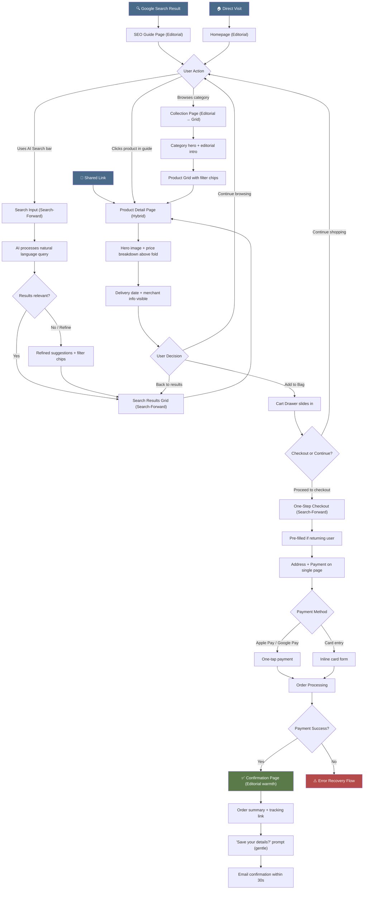
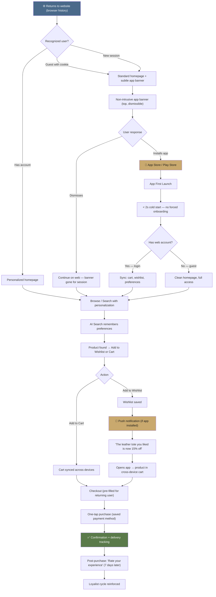
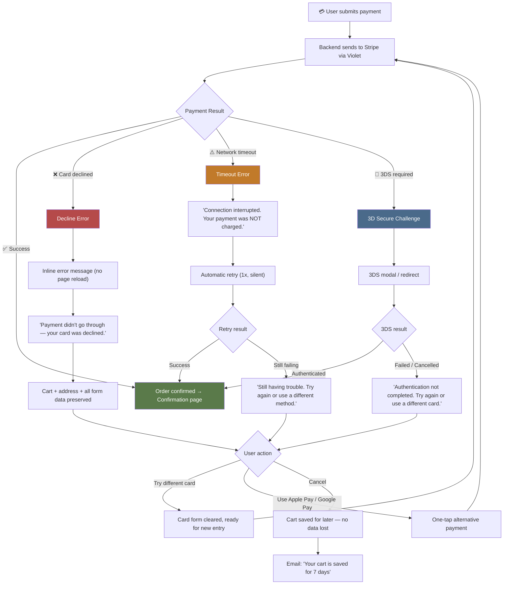
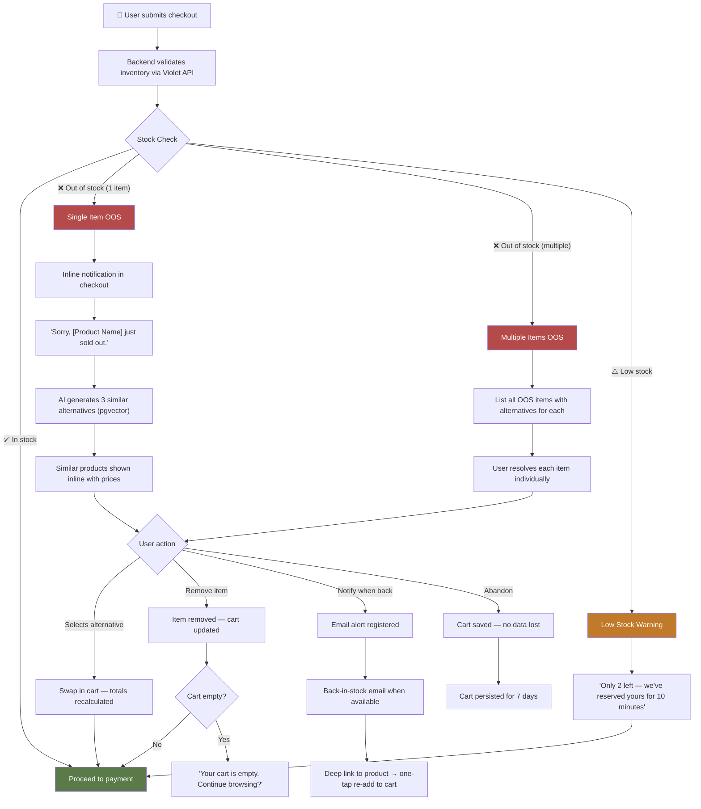
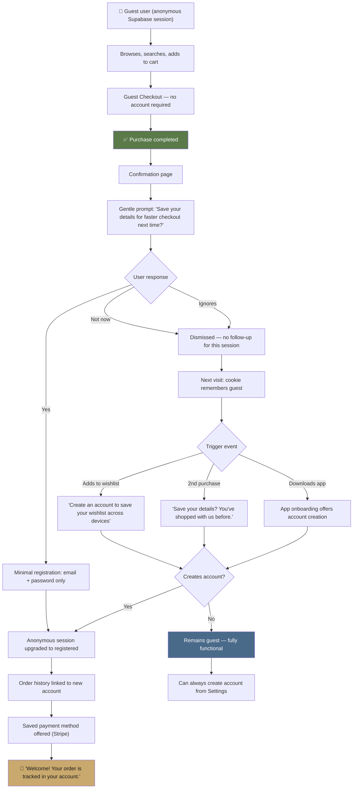

# UX Design Specification E-commerce

**Author:** Charles
**Date:** 2026-03-04

---

<!-- UX design content will be appended sequentially through collaborative workflow steps -->

## Executive Summary

### Project Vision

E-commerce is a white-label affiliate platform delivering a premium "Digital Personal Shopper" experience — web and mobile — without operating as a merchant. The platform aggregates partner product catalogs through embedded commerce APIs (Violet.io primary), presenting them under a single brand with integrated checkout, AI-powered conversational search, and centralized customer support. The product is not the physical goods; it is the shopping experience itself.

The UX philosophy is rooted in three pillars:

- **Premium minimalism** — Apple-style design DNA, anti-AliExpress aesthetic, zero dark patterns
- **AI-first discovery** — Conversational search as the primary product differentiator, replacing traditional keyword-based filtering
- **Invisible complexity** — Multi-supplier orchestration, affiliate model, and payment routing completely hidden from the user

### Target Users

**Primary Persona: Search-Driven Discoverer**
Arrives via organic Google search (product reviews, comparisons, guides). Frustrated by Amazon's overwhelming choice and low-trust affiliate sites. Values clean design, honest content, and frictionless guest checkout. Success moment: "I found what I wanted in 2 minutes and checked out without creating an account."

**Secondary Persona: Returning Loyalist**
Former Discoverer who downloads the mobile app after a positive first experience. Uses AI conversational search in natural language. Expects cross-device cart sync, personalized suggestions, and push notifications that feel like a personal shopper — not spam. Success moment: "This app just gets me."

**Tertiary Persona: Premium Seeker**
Quality-over-price buyer who actively avoids dark patterns and manipulation. Values transparent pricing, honest affiliate disclosure, and sober design. The platform's anti-manipulation stance is a feature, not a compromise. Success moment: "Finally, a shopping site that treats me like an adult."

### Key Design Challenges

1. **Transparency Paradox** — Delivering a white-label experience indistinguishable from a premium store while honestly disclosing the affiliate model. The disclosure must feel natural and trust-building, not like a legal disclaimer.

2. **AI Search Paradigm Shift** — Training users to describe needs conversationally ("gift for my dad who likes cooking") rather than type keywords. The interface must bridge familiar search patterns with the new conversational model.

3. **Guest-First Architecture** — Making account creation optional and attractive without gating any core functionality. The value proposition for registration must come from enhanced features (wishlist, history, notifications), not from access barriers.

4. **Invisible Multi-Supplier Orchestration** — A single cart may contain products from multiple merchants via Violet.io. The UX must present a unified checkout, single order tracking, and centralized support — completely hiding the multi-supplier reality.

5. **Cross-Device Continuity** — Seamless experience between web (SEO acquisition) and mobile (retention). Cart sync, wishlist persistence, and authentication must work frictionlessly across platforms.

### Design Opportunities

1. **Anti-Amazon Positioning** — Every UX decision reinforces the "no dark patterns" stance: no fake urgency, no manufactured scarcity, no forced upsells, no pop-ups. This is a competitive differentiator, not just ethics.

2. **AI as Personal Shopper** — The conversational search can go beyond results to explain recommendations, ask clarifying questions, and learn preferences over time. An opportunity to create an entirely new interaction pattern in e-commerce.

3. **Post-Purchase Wow Moment** — The order confirmation page as a premium branding touchpoint. While competitors show generic receipts, this platform can deliver a polished, memorable post-purchase experience that drives loyalty and app downloads.

4. **Respectful Push Notifications** — Ultra-targeted, opt-out-granular notifications that feel like a personal shopper's whisper rather than marketing spam. Positioning notification quality as a feature differentiator.

## Core User Experience

### Defining Experience

The core experience is a **trust-driven shopping journey** — from discovery to purchase, every interaction must inspire confidence. The platform wins not by being flashy, but by being trustworthy, honest, and effortless.

**The Core Loop:**

1. **Discover** — User arrives via SEO content or browses the catalog. AI conversational search is available as an accelerator, not a gatekeeper.
2. **Evaluate** — Apple-style product pages with essential information only. No noise, no manipulation, no dark patterns.
3. **Purchase** — One-step guest checkout with Apple Pay / Google Pay. Under 45 seconds from cart to confirmation.
4. **Return** — Experience quality drives organic return. Cross-device cart, wishlist, and targeted notifications create a natural retention loop.

**The Critical Interaction:** The entire trust chain — not a single interaction, but the cumulative feeling of "this site respects me" from first page load to order confirmation. If any single touchpoint breaks trust (a pop-up, a forced signup, a confusing checkout), the chain fails.

### Platform Strategy

**Dual-Platform with Parity:**

| Platform                     | Role                                                                  | Experience Level                    |
| ---------------------------- | --------------------------------------------------------------------- | ----------------------------------- |
| **Web (Desktop)**            | SEO acquisition surface, primary discovery channel                    | Full experience                     |
| **Web (Mobile Browser)**     | Same experience as native app, with gentle app download encouragement | Full experience + app prompt        |
| **Mobile App (iOS/Android)** | Retention engine, personalized experience, push notifications         | Full experience + enhanced features |

**Web Mobile ↔ Native App Parity:**

- Web mobile delivers the complete shopping experience — no feature gating to force app downloads
- A dismissible, non-intrusive banner encourages app installation: "Get the app for a better experience" — once per session, after first product view
- The app earns downloads through experience quality, not through artificial limitations

**Offline Mode (MVP / Phase 1):**

- Basic best practices only: graceful offline detection, cached cart preservation, clear "you're offline" messaging
- No offline browsing, no cached search results, no local product storage
- Phase 2 investment: SQLite/MMKV local cache, offline wishlist, cached recent products

### Effortless Interactions

Three interactions must feel magical — zero friction, zero thought required:

**1. Cross-Device Cart Sync**

- User adds item on web → opens mobile app → item is there. No login prompt, no sync button, no delay.
- Latency target: < 1 second sync between platforms
- Works for both guest users (via session token) and registered users

**2. Guest Checkout in Under 45 Seconds**

- Single page: shipping address → payment (Apple Pay / Google Pay one-tap) → confirm
- No account creation wall. No "are you sure you don't want to save 10%?" interruption
- Auto-fill leveraged aggressively (browser autofill, payment APIs)
- The fewer fields visible, the better

**3. AI Search That Understands First Try**

- User types natural language ("gift for my dad who likes cooking, budget $150") → relevant, curated results appear
- No need to reformulate, no "did you mean...?" — the AI gets it
- Results include brief explanations of why each product matches the query
- Fallback: if AI search is unused, traditional category browsing and filtering work perfectly

### Critical Success Moments

**Moment 1: First Page Load (< 1.5s FCP)**
"This looks... different. Clean. No pop-ups. No chaos." — The first 3 seconds determine whether the user stays or bounces. Premium design must be immediate.

**Moment 2: First AI Search Result (if used)**
"It actually understood what I meant." — The AI returns relevant results from a natural language query. The user realizes this isn't a gimmick.

**Moment 3: The Checkout Revelation**
"Wait — that's it? I'm done?" — User completes purchase in under 45 seconds with guest checkout. No account creation, no 4-step wizard, no cross-sell page. The simplicity is shocking.

**Moment 4: The Post-Purchase Wow**
"This confirmation page is actually... beautiful." — Instead of a generic receipt, a polished confirmation with clear order summary, tracking info, and a memorable brand moment. This is where app download conversion happens naturally.

**Moment 5: The Return Visit Recognition**
"My cart is still here." — User returns days later (web or app) and their previous session state is preserved. Cross-device sync just works.

### Experience Principles

Five guiding principles for every UX decision:

1. **Trust Over Conversion** — Never sacrifice user trust for short-term conversion metrics. No dark patterns, no manufactured urgency, no deceptive design. If a design choice feels manipulative, it's wrong.

2. **Visible But Not Dominant AI** — AI conversational search is a powerful accelerator, always accessible, but never the only path. Traditional browsing, categories, and filters work independently. The AI enhances — it doesn't gatekeep.

3. **Progressive Disclosure of Value** — Don't front-load complexity. Show the minimum needed at each step. Account creation, wishlists, notifications — these reveal their value naturally through usage, never through forced prompts.

4. **Platform Parity, Not Platform Punishment** — Every platform (desktop, mobile web, native app) delivers the full experience. The app earns downloads by being better, not by making the web worse.

5. **Effortless by Default** — If the user has to think about how to do something, the design has failed. Auto-fill, one-tap payments, cross-device sync, smart defaults — remove every possible friction point.

## Desired Emotional Response

### Primary Emotional Goals

**Dominant Emotion: Trust (Confiance)**
Every interaction, every pixel, every micro-interaction must reinforce one feeling: "I can trust this platform." Trust is the emotional foundation — without it, the white-label affiliate model fails. With it, the platform becomes a destination.

**Supporting Emotions:**

| Emotion         | When It Appears                  | Design Expression                                                                                                               |
| --------------- | -------------------------------- | ------------------------------------------------------------------------------------------------------------------------------- |
| **Confidence**  | Browsing, evaluating products    | Sober, modern design with a touch of luxury. Clean typography, generous whitespace, quality imagery                             |
| **Relief**      | Checkout completion              | "That was easy." One-step guest checkout that feels like a breath of fresh air after Amazon's complexity                        |
| **Respect**     | Throughout the experience        | No dark patterns, no manipulation, no pop-ups. The user feels treated as an intelligent adult                                   |
| **Reassurance** | Error states, order tracking     | "They've got this." Clear communication, proactive updates, no ambiguity                                                        |
| **Surprise**    | Post-purchase, AI search results | "I didn't expect this to be this good." Subtle moments of delight — the wow confirmation page, the AI that actually understands |

### Emotional Journey Mapping

**Stage 1: Arrival (SEO Landing)**

- **Target Emotion:** Instant credibility → "This is different from other sites"
- **Design Lever:** Sober, modern aesthetic with a hint of luxury. No visual clutter. The design itself communicates quality before the user reads a word.
- **Anti-Pattern:** No newsletter pop-up within 3 seconds. No cookie banner larger than necessary. No auto-playing anything.

**Stage 2: Browsing & Discovery**

- **Target Emotion:** Calm confidence → "I can find what I need here"
- **Design Lever:** Uncluttered product pages, honest information, AI search available but not forced. Categories and filters work perfectly for users who prefer traditional browsing.
- **Anti-Pattern:** No "Only 2 left!" urgency. No "47 people viewing this!" pressure. No infinite scroll fatigue.

**Stage 3: Product Evaluation**

- **Target Emotion:** Informed trust → "I have everything I need to decide"
- **Design Lever:** Essential information only — hero image, clear price (no fake discounts), honest description, transparent internal review. FTC affiliate disclosure integrated naturally at the bottom.
- **Anti-Pattern:** No "was $299 now $149!!!" fake markdowns. No manufactured reviews. No forced comparison tables.

**Stage 4: Checkout**

- **Target Emotion:** Relief + Surprise → "Wait, that's it?"
- **Design Lever:** One page, minimal fields, Apple Pay / Google Pay one-tap. The absence of friction IS the emotional moment.
- **Anti-Pattern:** No forced account creation. No cross-sell page. No "add gift wrapping for $5?" upsell.

**Stage 5: Post-Purchase**

- **Target Emotion:** Delight + Reassurance → "This was a great experience"
- **Design Lever:** Polished confirmation page (the "wow moment"), clear order summary, tracking info, subtle app download suggestion. Proactive email/push updates on order status.
- **Anti-Pattern:** No "rate us 5 stars!" immediate ask. No "share on social media!" pressure.

**Stage 6: Error / Problem States**

- **Target Emotion:** Reassurance → "They've got this, I'm informed"
- **Design Lever:** Clear, honest error messaging. Proactive communication about delays or issues. Centralized support contact visible. The user feels informed, not abandoned.
- **Anti-Pattern:** No vague "something went wrong" messages. No hiding behind supplier policies. The platform owns the communication even when the supplier owns the resolution.

**Stage 7: Return Visit**

- **Target Emotion:** Recognition + Belonging → "This place remembers me"
- **Design Lever:** Cart still intact, browsing context preserved, AI suggestions improving over time. The platform gets better with each visit.
- **Anti-Pattern:** No "we missed you!" guilt messaging. No aggressive re-engagement pop-ups.

### Micro-Emotions

**Trust Signals (continuous, ambient):**

- Consistent visual language across every page — no "template switching" between sections
- Smooth, purposeful animations (never decorative — always communicating state)
- Professional typography and generous whitespace — the visual language of quality
- HTTPS, privacy-first language, clear data handling — technical trust

**Confidence Builders (at decision points):**

- Clear, unambiguous pricing — the number you see is the number you pay
- Transparent affiliate disclosure — positioned as honesty, not legal obligation
- Internal review system — the platform's own curation signals, not fake user reviews
- Shipping and return information visible before checkout — no surprises

**Emotions to Actively Prevent:**

- **Anxiety** — caused by urgency tactics, countdown timers, scarcity messaging
- **Suspicion** — caused by too-good-to-be-true pricing, hidden fees, unclear business model
- **Frustration** — caused by forced account creation, complex checkout, broken flows
- **Guilt** — caused by "you're missing out!" messaging, abandoned cart shame emails
- **Overwhelm** — caused by infinite choices, cluttered layouts, information overload

### Design Implications

**Emotion → Design Translation:**

| Emotional Goal   | Concrete Design Choice                                                                               |
| ---------------- | ---------------------------------------------------------------------------------------------------- |
| Trust            | Sober color palette, premium typography, generous whitespace, consistent visual system               |
| Confidence       | Clear pricing, visible shipping info, transparent affiliate disclosure, internal reviews             |
| Relief           | One-step checkout, minimal form fields, Apple Pay / Google Pay, no forced signup                     |
| Reassurance      | Proactive order updates, clear error messages, visible support contact, honest communication         |
| Respect          | Zero dark patterns, no pop-ups, no urgency tactics, no manipulation, FTC disclosure as trust signal  |
| Surprise/Delight | Wow confirmation page, AI search that works, subtle micro-animations, cross-device cart "just works" |

**The Luxury-Sober Design Language:**

- Not flashy luxury (no gold gradients, no serif-heavy "premium" clichés)
- Quiet luxury — the kind that communicates quality through restraint
- Think: Aesop (skincare), Apple (tech), Everlane (fashion) — brands where the design whispers quality
- Color palette: neutral base (whites, warm grays) with a single accent color used sparingly
- Typography: one premium sans-serif family, used with discipline and generous spacing

### Emotional Design Principles

1. **Trust Is Earned in Milliseconds, Lost in One Mistake** — Every design decision is a trust transaction. The sober, modern, quietly luxurious aesthetic builds trust from the first millisecond. One pop-up, one dark pattern, one moment of confusion destroys it.

2. **Restraint Is Luxury** — The fewer elements on screen, the more premium the experience feels. Whitespace is not wasted space — it's a trust signal. Every element that exists has earned its place.

3. **Honesty as Design Feature** — The FTC affiliate disclosure, the transparent pricing, the honest product descriptions — these are not legal obligations to minimize. They are design features that build the platform's most valuable asset: trust.

4. **Errors Are Trust Opportunities** — When something goes wrong (payment failure, stock issue, delivery delay), the quality of the error experience determines whether trust survives. Inform clearly, reassure calmly, resolve proactively. The user should feel more confident in the platform AFTER an error is handled well.

5. **Absence as Delight** — The most delightful moment in checkout is the absence of the expected annoyance. No account wall. No upsell. No 4-step wizard. The delight comes from what's NOT there.

## UX Pattern Analysis & Inspiration

### Inspiring Products Analysis

**1. Apple Store (apple.com/shop) — The Gold Standard of E-commerce Minimalism**

- **What they nail:** Product pages are 90% image and whitespace. The product speaks for itself. No review spam, no "customers also bought", no urgency. Checkout is legendary — Apple Pay one-tap, minimal fields, zero friction.
- **Transferable to E-commerce:** The philosophy that fewer elements = more trust. Product pages should feel like a gallery, not a marketplace. Checkout should feel like it's already done before you realize it started.
- **What to adapt:** Apple can afford zero reviews because their brand IS the review. E-commerce needs an internal review/curation system to build equivalent trust for multi-brand products.

**2. Everlane — Radical Transparency as Brand**

- **What they nail:** "Transparent Pricing" breakdown on every product — showing materials cost, labor cost, transport, markup. The honesty IS the marketing. Clean, editorial photography. No sales pressure.
- **Transferable to E-commerce:** The affiliate disclosure can follow the same philosophy. Instead of hiding "we earn a commission" in footer fine print, present it as a trust feature: "We earn a commission on every purchase. That's how we stay independent and keep this experience ad-free." Honesty as brand identity.
- **What to adapt:** Everlane's cost breakdown model maps to showing clear, single prices with no hidden fees. "The price you see is the price you pay. No surprises at checkout."

**3. Aesop — Quiet Luxury Through Design Restraint**

- **What they nail:** Extreme restraint — monochromatic palette, one typeface family, enormous whitespace. The website feels like walking into a physical store: calm, curated, unhurried. Product descriptions are sparse but precise. Navigation is minimal.
- **Transferable to E-commerce:** The emotional register — "quiet luxury" — is exactly the design language defined in Step 4. Warm neutrals, one accent color, typography that whispers quality. The product grid should breathe, not crowd.
- **What to adapt:** Aesop sells a single brand. E-commerce aggregates multiple brands, so the visual system must create a unified identity that absorbs different product photography styles without looking inconsistent.

**4. Linear (linear.app) — Functional Minimalism & Micro-Interactions**

- **What they nail:** Every animation is purposeful — communicating state change, not decoration. Keyboard shortcuts for power users. Interface that feels fast because it IS fast. Dark/light mode that both feel premium. Search is central and powerful (Cmd+K pattern).
- **Transferable to E-commerce:** The Cmd+K search pattern can inform AI search interaction — a universal, always-accessible search bar that responds instantly. Purposeful micro-animations for cart additions, state changes, checkout steps. Performance as a design feature (< 1.5s FCP target).
- **What to adapt:** Linear serves power users who learn shortcuts. E-commerce serves casual shoppers who need zero learning curve. The AI search must be immediately intuitive, not requiring keyboard shortcuts or learned behavior.

**5. Arc Browser — Reimagining a Familiar Paradigm**

- **What they nail:** Took something everyone knows (a web browser) and rethought the entire interaction model. Clean, minimal chrome. Features that reveal themselves progressively. Bold enough to remove expected elements (the traditional URL bar).
- **Transferable to E-commerce:** The courage to remove expected e-commerce elements. No sidebar filter panel cluttering the page. No "sort by" dropdown with 15 options. The AI search replaces traditional navigation — not by hiding alternatives, but by being so good that traditional patterns become optional.
- **What to adapt:** Arc's progressive disclosure — features appear when needed, not all at once. Account features, wishlist, notification preferences — all hidden until contextually relevant.

### Transferable UX Patterns

**Navigation Patterns:**

| Pattern                                | Source       | Application to E-commerce                                                                                                                                                                                     |
| -------------------------------------- | ------------ | ------------------------------------------------------------------------------------------------------------------------------------------------------------------------------------------------------------- |
| **Universal Search Bar** (Cmd+K style) | Linear       | AI conversational search as the primary — but optional — discovery mechanism. Always accessible, never mandatory. Clean input field with placeholder suggesting natural language: "What are you looking for?" |
| **Minimal Top Navigation**             | Aesop, Apple | Maximum 5-6 top-level categories. No mega-menus with 50 sub-categories. Categories serve users who prefer browsing; AI search serves those who know what they want.                                           |
| **Progressive Disclosure**             | Arc          | Show category filters only when browsing a category. Show account features only when logged in. Show shipping details only at checkout. Nothing appears before it's needed.                                   |

**Interaction Patterns:**

| Pattern                         | Source                | Application to E-commerce                                                                                                                                                                            |
| ------------------------------- | --------------------- | ---------------------------------------------------------------------------------------------------------------------------------------------------------------------------------------------------- |
| **One-Tap Purchase**            | Apple Store           | Apple Pay / Google Pay as primary checkout action. The fewer taps between "I want this" and "I bought this", the better. Target: 3 taps maximum (Add to Cart → Checkout → Pay).                      |
| **Purposeful Micro-Animations** | Linear                | Cart icon animates subtly when item added. Checkout progress communicates state. Loading states feel intentional, not broken. Every animation serves a purpose — none are decorative.                |
| **Contextual AI**               | 2026 e-commerce trend | AI search results include brief "why this matches" explanations. Not just products — conversational context. "Based on your description of a cooking gift around $150, here's what I'd recommend..." |

**Visual Patterns:**

| Pattern                           | Source      | Application to E-commerce                                                                                                                                                       |
| --------------------------------- | ----------- | ------------------------------------------------------------------------------------------------------------------------------------------------------------------------------- |
| **Gallery-Style Product Pages**   | Apple Store | Hero image dominates. Price visible but not screaming. Description is concise. Reviews are curated/internal, not user-generated spam. Generous whitespace around every element. |
| **Monochromatic + Single Accent** | Aesop       | Neutral base palette (warm whites, soft grays). One accent color for CTAs and interactive elements. No competing colors, no visual noise. The products provide the color.       |
| **Editorial Typography**          | Everlane    | One premium sans-serif family. Large headings, generous line spacing, clear hierarchy. Typography as the primary design tool — not color, not imagery, not decoration.          |

### Anti-Patterns to Avoid

**E-commerce Dark Patterns (from Amazon, AliExpress, Booking.com):**

| Anti-Pattern                            | Why It Fails                                  | Our Approach                                                                                                      |
| --------------------------------------- | --------------------------------------------- | ----------------------------------------------------------------------------------------------------------------- |
| "Only 2 left in stock!"                 | Manufactured urgency destroys trust           | Show real availability without pressure. If stock is genuinely low, state it factually.                           |
| "47 people are viewing this!"           | Pressure tactic disguised as social proof     | No social pressure. The product page is for the user, not a competition.                                          |
| "Was $299, now $149!!!"                 | Fake discounts erode pricing trust            | One clear price. If a real sale exists, show it honestly: "Sale: $149 (regular $179)" — no inflated "was" prices. |
| Forced account creation at checkout     | Conversion killer for first-time buyers       | Guest checkout as default. Account creation offered post-purchase: "Want to track this order? Create an account." |
| 4-step checkout wizard                  | Each step is an exit point                    | One page. One step. Shipping, payment, confirm — all visible at once.                                             |
| Newsletter pop-up on arrival            | Immediate trust violation                     | No pop-ups. Ever. Newsletter opt-in only in footer or account settings.                                           |
| "Customers also bought" cross-sell page | Delays checkout, feels manipulative           | No cross-sell between cart and checkout. Related products only on product pages, subtly.                          |
| Abandoned cart guilt emails             | "You left something behind!" feels accusatory | If cart recovery emails exist, they are helpful ("Your cart is saved for 7 days") not guilt-inducing.             |

**UX Complexity Anti-Patterns (from over-designed products):**

| Anti-Pattern                            | Why It Fails                                    | Our Approach                                                              |
| --------------------------------------- | ----------------------------------------------- | ------------------------------------------------------------------------- |
| Mega-menu with 50+ categories           | Overwhelming, suggests infinite scroll catalog  | Maximum 5-6 categories. AI search handles the long tail.                  |
| Filter sidebar with 20+ facets          | Analysis paralysis, cluttered mobile experience | 3-5 essential filters per category. AI search replaces complex filtering. |
| Infinite scroll product grids           | No sense of progress, no endpoint               | Paginated results with clear count: "Showing 12 of 48 products."          |
| Multiple CTAs competing on product page | Confusion about primary action                  | One primary CTA per page: "Add to Cart." Everything else is secondary.    |

### Design Inspiration Strategy

**Adopt Directly:**

- Apple Store's gallery-style product pages with dominant imagery and minimal text
- Aesop's warm neutral palette with single accent color as the visual foundation
- Linear's purposeful micro-animations for state changes (cart, checkout, loading)
- Everlane's transparency-as-brand philosophy for affiliate disclosure positioning
- Apple Store's one-tap checkout flow as the benchmark for purchase friction

**Adapt for E-commerce:**

- Linear's Cmd+K search → an always-visible, conversational AI search bar with natural language placeholder text — adapted for casual shoppers, not power users
- Arc's progressive disclosure → features appear contextually (filters when browsing, account options when logged in, shipping info at checkout) — adapted for zero-learning-curve shopping
- Aesop's single-brand consistency → a unified visual system that absorbs multi-brand product photography while maintaining platform identity

**Avoid Categorically:**

- Every dark pattern listed above — Amazon/AliExpress/Booking.com manipulation tactics
- Over-engineered navigation (mega-menus, filter overload, infinite scroll)
- Decorative animations that serve no functional purpose
- Any design element that prioritizes conversion metrics over user trust
- Visual complexity that contradicts the "quiet luxury" emotional register

## Design System Foundation

### Design System Choice

**Approach: Vanilla CSS (99%) + Minimal External Library for Notifications/Badges**

The design system is built entirely on vanilla CSS — no Tailwind, no CSS-in-JS, no utility frameworks. This is a deliberate architectural decision aligned with the "quiet luxury" vision: total pixel-level control, zero framework opinions, minimal bundle size, and maximum performance.

**The only exception:** A lightweight, quality-focused library for badges and notification UI components, ensuring accessibility and cross-platform consistency for these interaction-critical elements.

### Rationale for Selection

**Why Vanilla CSS:**

1. **Total Creative Control** — No framework defaults to override. Every spacing, color, transition, and layout is intentional. The "quiet luxury" register demands precision that frameworks approximate but never match perfectly.

2. **Performance as Trust Signal** — Zero CSS runtime overhead. No unused utility classes shipped to the browser. The CSS payload is exactly what's needed — nothing more. This directly supports the < 1.5s FCP target and the "instant credibility" emotional goal.

3. **No Visual Leakage** — Framework-based sites leak their foundation. Experienced users recognize Tailwind spacing patterns, Material Design elevation, Bootstrap grid behavior. Vanilla CSS ensures the platform has its own visual fingerprint — unrecognizable as "built with X."

4. **Solo-Dev Ownership** — No dependency updates, no breaking changes from upstream, no framework migration debt. The CSS is fully owned, fully understood, fully controlled by one person.

5. **Cross-Platform Foundation** — CSS custom properties (design tokens) defined once can inform both web styling and React Native StyleSheet values, creating a single source of truth without a framework intermediary.

**Why Exception for Badges/Notifications:**

- Notification badges require precise z-index management, animation timing, accessibility (ARIA live regions), and cross-browser consistency
- A focused, lightweight library ensures these interaction-critical elements are production-quality from day one
- The library footprint is minimal — scoped to one specific UI concern, not a full design system dependency

### Implementation Approach

**CSS Architecture:**

```
styles/
├── tokens/
│   ├── colors.css          /* CSS custom properties: palette */
│   ├── typography.css      /* Font families, sizes, weights, line-heights */
│   ├── spacing.css         /* Spacing scale (4px base) */
│   ├── breakpoints.css     /* Responsive breakpoints */
│   └── animations.css      /* Transition durations, easings */
├── base/
│   ├── reset.css           /* Minimal, modern CSS reset */
│   ├── global.css          /* Base element styles */
│   └── accessibility.css   /* Focus styles, reduced motion, screen reader */
├── layouts/
│   ├── grid.css            /* Product grid, content layouts */
│   ├── page.css            /* Page-level structure */
│   └── responsive.css      /* Mobile-first responsive rules */
└── components/
    ├── search-bar.css      /* AI search input */
    ├── product-card.css    /* Product grid cards */
    ├── product-page.css    /* Product detail page */
    ├── checkout.css        /* One-step checkout */
    ├── cart.css            /* Cart drawer/page */
    ├── navigation.css      /* Header, nav, footer */
    └── confirmation.css    /* Post-purchase wow page */
```

**Design Tokens (CSS Custom Properties):**

```css
:root {
  /* Color Palette — Quiet Luxury */
  --color-bg-primary: #fafaf9; /* Warm white */
  --color-bg-secondary: #f5f5f4; /* Soft warm gray */
  --color-text-primary: #1c1917; /* Near-black, warm */
  --color-text-secondary: #57534e; /* Muted warm gray */
  --color-accent: /* TBD — single accent color */;
  --color-accent-hover: /* TBD */;
  --color-border: #e7e5e4; /* Subtle border */
  --color-error: #dc2626; /* Clear, not alarming */
  --color-success: #16a34a; /* Confirmation green */

  /* Typography — Dual Typeface System */
  --font-display: "Cormorant Garamond", Georgia, serif;
  --font-body: "Inter", system-ui, sans-serif;
  --font-size-xs: 0.75rem; /* 12px — captions */
  --font-size-sm: 0.875rem; /* 14px — secondary text */
  --font-size-base: 1rem; /* 16px — body */
  --font-size-lg: 1.25rem; /* 20px — section titles */
  --font-size-xl: 1.5rem; /* 24px — page titles */
  --font-size-2xl: 2rem; /* 32px — hero headings */
  --font-weight-regular: 400;
  --font-weight-medium: 500;
  --font-weight-semibold: 600;
  --line-height-tight: 1.25;
  --line-height-normal: 1.5;
  --line-height-relaxed: 1.75;

  /* Spacing — 4px Base Scale */
  --space-1: 0.25rem; /* 4px */
  --space-2: 0.5rem; /* 8px */
  --space-3: 0.75rem; /* 12px */
  --space-4: 1rem; /* 16px */
  --space-6: 1.5rem; /* 24px */
  --space-8: 2rem; /* 32px */
  --space-12: 3rem; /* 48px */
  --space-16: 4rem; /* 64px */
  --space-24: 6rem; /* 96px */

  /* Transitions — Purposeful, Not Decorative */
  --transition-fast: 150ms ease;
  --transition-normal: 250ms ease;
  --transition-slow: 400ms ease;

  /* Borders */
  --radius-sm: 8px;
  --radius-md: 12px;
  --radius-lg: 16px;
  --radius-full: 9999px;

  /* Shadows — Subtle, Warm */
  --shadow-sm: 0 1px 2px rgba(28, 25, 23, 0.05);
  --shadow-md: 0 4px 6px rgba(28, 25, 23, 0.07);
  --shadow-lg: 0 10px 15px rgba(28, 25, 23, 0.1);
}
```

**Responsive Strategy:**

```css
/* Mobile-first breakpoints */
--breakpoint-sm: 640px; /* Large phones */
--breakpoint-md: 768px; /* Tablets */
--breakpoint-lg: 1024px; /* Small desktops */
--breakpoint-xl: 1280px; /* Large desktops */
--breakpoint-2xl: 1440px; /* Wide screens */
```

### Customization Strategy

**Design Token Governance:**

- All visual values live in CSS custom properties — never hardcoded in component CSS
- Accent color TBD during visual design phase — one color, used sparingly for CTAs and interactive states
- Typography font family can be swapped by changing one variable (Inter is a starting point — may evaluate alternatives like Satoshi, Geist, or DM Sans during branding phase)

**Component Naming Convention:**

- BEM-inspired: `.product-card`, `.product-card__image`, `.product-card--featured`
- No abbreviations, no utility classes — readability over brevity
- Component CSS files mirror component file structure

**Cross-Platform Token Sharing:**

- CSS custom properties (web) → exported as a shared TypeScript constants file → consumed by React Native StyleSheet (mobile)
- One source of truth for colors, spacing, typography values
- Platform-specific adjustments (touch targets, safe areas) handled in platform CSS/styles, not in tokens

**Accessibility Foundation:**

- Focus-visible styles on all interactive elements (no outline removal)
- prefers-reduced-motion media query respected for all animations
- prefers-color-scheme ready (dark mode foundation for Phase 2)
- Minimum touch target: 44×44px on all interactive elements
- Color contrast: WCAG AA minimum (4.5:1 for text, 3:1 for large text)

**What Won't Be Custom (the exception):**

- Badge/notification components: evaluate lightweight, focused libraries (e.g., Sonner for toasts, or a minimal notification badge component) — scoped strictly to this one concern
- Selection criteria: < 5KB gzipped, accessible, customizable styling, no heavy dependencies

## 2. Core User Experience

### 2.1 Defining Experience

**"Find the perfect product and buy it with complete confidence in under a minute."**

This is the Digital Personal Shopper's defining interaction — the moment users will describe to friends. It combines three inseparable pillars:

1. **Intelligent Discovery**: AI-assisted search that understands intent, not just keywords — but remains an optional accelerator, never a gatekeeper
2. **Radical Transparency**: Every price, fee, shipping cost, and delivery timeline visible before commitment — no surprises, no hidden costs
3. **Frictionless Commitment**: From "I want this" to "It's ordered" in a single, trust-inspiring flow

The defining experience is NOT any one of these in isolation. It's the seamless chain: _discover → understand → trust → buy_ — compressed into a flow so natural it feels effortless.

**The One-Sentence Test**: If a user can find a product, understand exactly what they'll pay and when they'll receive it, and complete the purchase — all within 60 seconds — we've nailed it.

### 2.2 User Mental Model

**How users currently solve this problem:**

Users today navigate a fragmented landscape:

- **Amazon**: Massive selection but overwhelming. Trust eroded by fake reviews, opaque pricing (Prime vs non-Prime), and algorithmic manipulation. Users develop coping mechanisms: filtering by "Prime only", reading 1-star reviews first, checking CamelCamelCamel for price history.
- **Google Shopping**: Good for price comparison but a redirect hub — users bounce between tabs, lose context, re-enter payment info repeatedly. Mental model: "research tool, not buying tool."
- **Specialized boutiques** (Aesop, Everlane): High trust, curated experience, but limited selection. Users go here when they know what they want and value quality over breadth.
- **Instagram/TikTok Shopping**: Impulse-driven discovery but low trust for unknown brands. Users screenshot products and search elsewhere to buy.

**What users love about existing solutions:**

- Amazon's one-click ordering (speed)
- Everlane's radical price transparency (trust)
- Apple Store's clean, confident product pages (clarity)
- Google Shopping's ability to compare across merchants (control)

**What users hate:**

- Hidden fees appearing at checkout (betrayal of trust)
- Overwhelming choice with no curation (decision fatigue)
- Inconsistent shipping information (uncertainty)
- Dark patterns pushing unwanted additions (manipulation)

**Mental model they bring:**
Users arrive with a "cautious shopper" mindset — they expect to be sold to, and they've built defenses. Our opportunity is to disarm those defenses through genuine transparency rather than persuasion tactics.

### 2.3 Success Criteria

**Core Experience Success Criteria** (ordered by user priority):

**Priority 1 — Transparency ("I know exactly what I'm getting")**

- Total cost (product + shipping + taxes) visible on product cards, not just at checkout
- Delivery timeline shown as a concrete date range, not vague "3-5 business days"
- Return/refund policy summarized in plain language before purchase
- Merchant identity and reputation clearly communicated
- No price changes between browsing and checkout

**Priority 2 — Relevance ("It found what I actually wanted")**

- Search results match intent, not just keywords (AI-powered understanding)
- Filters that reflect how users think (by occasion, by style, by budget range)
- Personalized recommendations that improve with usage but don't feel invasive
- Zero irrelevant results on the first page

**Priority 3 — Speed ("That was surprisingly fast")**

- Product discovery to checkout completion: < 60 seconds for returning users
- Guest checkout: < 45 seconds with Apple Pay/Google Pay
- Page transitions: < 200ms perceived load time
- Search results: < 500ms response time

**Success Indicators:**

- Users complete purchases without opening competitor tabs for price verification
- Cart abandonment rate below industry average (currently ~70%)
- Users return within 30 days without acquisition marketing

### 2.4 Novel UX Patterns

| Interaction                | Pattern Type                        | Approach                                                                                                                                                                                             |
| -------------------------- | ----------------------------------- | ---------------------------------------------------------------------------------------------------------------------------------------------------------------------------------------------------- |
| AI Conversational Search   | **Novel** (familiar metaphor)       | Chat-like input, but results displayed as a curated product grid — not a chatbot conversation. Uses the familiar search bar metaphor with natural language understanding underneath.                 |
| Radical Price Transparency | **Innovative twist on established** | Price breakdowns exist on some sites, but showing total landed cost (product + shipping + taxes + fees) directly on product cards is rare. Our twist: make it the default, not an expandable detail. |
| One-Step Guest Checkout    | **Established**                     | Apple Pay / Google Pay patterns users already know. No innovation needed — just flawless execution.                                                                                                  |
| Trust Indicators           | **Established, curated**            | Merchant ratings, secure payment badges, delivery guarantees — but presented in the Aesop/Apple visual language rather than the typical "trust badge spam."                                          |
| Smart Recommendations      | **Established with restraint**      | "You might also like" — but only when genuinely relevant, never as filler. Quality over quantity.                                                                                                    |

**Teaching strategy for novel patterns:**

- AI search is accessed via a standard search bar — no new UI to learn
- Natural language capability revealed progressively: placeholder text suggests "Try: 'red dress under 50€ for a summer wedding'"
- Falls back gracefully to keyword search if AI doesn't improve results
- Never forces users into conversational mode — type keywords, get results

### 2.5 Experience Mechanics

**Core Experience: "Discover → Trust → Buy"**

**1. Initiation — How discovery begins:**

| Entry Point       | Trigger                                         | Experience                                                |
| ----------------- | ----------------------------------------------- | --------------------------------------------------------- |
| Search bar        | User types query (keywords or natural language) | Instant suggestions appear; AI interprets intent silently |
| Browse categories | User taps a curated category                    | Clean grid with smart default sorting                     |
| Recommendation    | Homepage or post-purchase                       | "Based on your style" — max 6 items, high relevance       |
| Direct link       | Shared product or marketing email               | Lands on product page with full context                   |

**2. Interaction — The core loop:**

```
[Search/Browse] → [Product Grid with transparent pricing]
                         ↓
              [Product Detail Page]
         - Hero image + price breakdown visible above fold
         - Delivery date + merchant info immediately visible
         - "Add to bag" or "Buy now" as primary actions
                         ↓
              [One-Step Checkout]
         - Pre-filled for returning users
         - Apple Pay/Google Pay for guests
         - Order summary with zero surprises
```

**System responses:**

- Every action gets immediate visual feedback (< 100ms)
- Loading states use skeleton screens, never spinners
- Errors explain what happened AND what to do next
- Success states feel celebratory but not excessive

**3. Feedback — How users know it's working:**

- **Search**: Results appear instantly; relevance is self-evident
- **Pricing**: "Total you'll pay" badge on every product — no mental math needed
- **Cart**: Running total updates in real-time with animated transitions
- **Checkout**: Progress is implicit (one step = no progress bar needed)
- **Errors**: Inline validation with helpful suggestions, never blocking modals

**4. Completion — The successful outcome:**

- **Order confirmation**: Clean summary page + email within 30 seconds
- **What's next**: Delivery tracking link immediately available
- **Emotional payoff**: "Your order is confirmed" — reassuring, not celebratory-spam
- **Gentle retention**: "We'll remember your preferences for next time" — not pushy account creation

## Visual Design Foundation

### Color System

**Strategy: Warm Neutral base with Midnight Gold premium accents**

The color system fuses two complementary palettes: Warm Neutral provides the everyday foundation (comfort, trust, approachability), while Midnight Gold accents create premium moments at key interaction points (CTAs, trust badges, success states).

**Primary Palette — Warm Neutral Base:**

| Token            | Value     | Usage                                          |
| ---------------- | --------- | ---------------------------------------------- |
| `--color-ivory`  | `#FAFAF8` | Page background                                |
| `--color-linen`  | `#F0EEEB` | Surface background (cards hover, input fields) |
| `--color-sand`   | `#E8E4DF` | Borders, dividers                              |
| `--color-stone`  | `#D5CEC6` | Disabled states, subtle backgrounds            |
| `--color-taupe`  | `#B8A28F` | Secondary accent, muted interactive elements   |
| `--color-sienna` | `#8B7355` | Secondary buttons, active states               |

**Premium Accent — Midnight Gold:**

| Token              | Value     | Usage                                           |
| ------------------ | --------- | ----------------------------------------------- |
| `--color-gold`     | `#C9A96E` | Primary CTA buttons, "Add to Bag", trust badges |
| `--color-amber`    | `#A68B4B` | CTA hover state, active gold                    |
| `--color-midnight` | `#2C2C2C` | Premium text emphasis, footer background        |

**Neutral Scale:**

| Token              | Value     | Usage                    |
| ------------------ | --------- | ------------------------ |
| `--color-ink`      | `#1A1A1A` | Primary text, headings   |
| `--color-charcoal` | `#3D3D3D` | Secondary text           |
| `--color-steel`    | `#5A5A5A` | Body text                |
| `--color-silver`   | `#999999` | Muted text, placeholders |

**Semantic Colors:**

| Token             | Value     | Usage                                               |
| ----------------- | --------- | --------------------------------------------------- |
| `--color-success` | `#5A7A4A` | Delivery confirmations, in-stock, positive feedback |
| `--color-warning` | `#C17A2A` | Low stock alerts, shipping delays                   |
| `--color-error`   | `#B54A4A` | Form errors, out of stock, payment failures         |
| `--color-info`    | `#4A6A8A` | Help text, informational banners                    |

**Accent Distribution Rule:**

- Gold accents limited to max 10-15% of any given screen
- Used exclusively for: primary CTAs, trust indicators, success moments, premium labels
- Never used for: backgrounds, large surfaces, navigation, body text

**Accessibility Compliance:**

| Pair             | Contrast Ratio | WCAG Level                                              |
| ---------------- | -------------- | ------------------------------------------------------- |
| Ink on Ivory     | 16.5:1         | AAA                                                     |
| Steel on Ivory   | 5.8:1          | AA                                                      |
| Gold on Midnight | 7.2:1          | AAA                                                     |
| Gold on Ivory    | 3.4:1          | AA Large only — use for headings ≥ 18px or buttons only |
| White on Gold    | 3.1:1          | AA Large only — acceptable for button text at 14px bold |
| Success on Ivory | 5.6:1          | AA                                                      |
| Error on Ivory   | 5.2:1          | AA                                                      |

### Typography System

**Strategy: Cormorant Garamond (serif) for premium headings + Inter (sans-serif) for interface**

The dual-typeface system creates instant visual hierarchy: serif communicates "product, prestige, content" while sans-serif communicates "interface, navigation, efficiency."

**Font Stack:**

```css
:root {
  --font-display: "Cormorant Garamond", "Georgia", "Times New Roman", serif;
  --font-body: "Inter", system-ui, -apple-system, "Segoe UI", sans-serif;
}
```

**Type Scale (1.25 ratio — Major Third):**

| Level      | Font      | Size | Weight | Line Height | Letter Spacing | Usage                                        |
| ---------- | --------- | ---- | ------ | ----------- | -------------- | -------------------------------------------- |
| Display    | Cormorant | 48px | 600    | 1.1         | -0.02em        | Hero headings, landing pages                 |
| H1         | Cormorant | 40px | 600    | 1.15        | -0.01em        | Page titles, collection names                |
| H2         | Cormorant | 30px | 500    | 1.2         | 0              | Section headings, product names on PDP       |
| H3         | Inter     | 22px | 500    | 1.3         | -0.01em        | Subsection headings, card titles             |
| H4         | Inter     | 18px | 600    | 1.4         | 0              | Minor headings, checkout section titles      |
| Body       | Inter     | 16px | 400    | 1.6         | 0              | Product descriptions, general content        |
| Body Small | Inter     | 14px | 400    | 1.5         | 0              | UI labels, form fields, secondary info       |
| Caption    | Inter     | 13px | 400    | 1.5         | 0.01em         | Delivery dates, merchant names, metadata     |
| Overline   | Inter     | 11px | 500    | 1.4         | 0.08em         | Category labels, merchant badges (uppercase) |

**Font Loading Strategy:**

- Inter: loaded via `font-display: swap` — system-ui fallback is visually close
- Cormorant Garamond: loaded via `font-display: optional` — Georgia fallback prevents layout shift on serif headings
- Both fonts subset to Latin + Latin Extended for minimal file size

**Serif Usage Rules:**

- Cormorant for: page titles, product names, collection names, checkout title, brand logo
- Inter for: navigation, buttons, form labels, body text, UI controls, prices
- Never mix serif/sans within the same element or sentence

### Spacing & Layout Foundation

**Strategy: Balanced layout (Apple Store-inspired) — generous white space with efficient product display**

**Base Unit: 4px**

| Token        | Value | Usage                                       |
| ------------ | ----- | ------------------------------------------- |
| `--space-1`  | 4px   | Tight spacing (icon gaps, inline elements)  |
| `--space-2`  | 8px   | Compact spacing (between related items)     |
| `--space-3`  | 12px  | Small spacing (form field gaps)             |
| `--space-4`  | 16px  | Standard spacing (card padding, list items) |
| `--space-5`  | 20px  | Card internal padding                       |
| `--space-6`  | 24px  | Section gaps within cards                   |
| `--space-8`  | 32px  | Section separators, card-to-card gap        |
| `--space-10` | 40px  | Major section spacing                       |
| `--space-12` | 48px  | Page section breaks                         |
| `--space-16` | 64px  | Hero spacing, major visual breaks           |

**Grid System:**

```css
.grid-layout {
  --grid-max-width: 1200px;
  --grid-columns: 12;
  --grid-gutter: 24px;
  --grid-margin: 32px; /* 16px on mobile */
}
```

**Product Grid:**

- Desktop: 3-4 columns (280px min card width)
- Tablet: 2 columns
- Mobile: 1-2 columns (toggle option)
- Gap: 24px consistent

**Layout Principles:**

1. **Breathing Room**: Minimum 32px between major sections. Cards have 20px internal padding. Never crowd elements.
2. **Content-First Density**: Show enough products to enable comparison (3-4 per row) without overwhelming. Quality over quantity in display.
3. **Progressive Disclosure**: Above-the-fold shows essential info (image, name, total price, delivery). Details expand on interaction, not by default.
4. **Consistent Rhythm**: All vertical spacing follows the 4px grid. Horizontal spacing uses the 12-column grid. No "magic numbers."

**Border Radius System:**

| Token           | Value  | Usage                                |
| --------------- | ------ | ------------------------------------ |
| `--radius-sm`   | 8px    | Small elements (badges, tags, chips) |
| `--radius-md`   | 12px   | Buttons, inputs, toasts              |
| `--radius-lg`   | 16px   | Cards, modals, containers            |
| `--radius-full` | 9999px | Avatars, circular buttons            |

**Shadow System:**

| Token            | Value                         | Usage                     |
| ---------------- | ----------------------------- | ------------------------- |
| `--shadow-sm`    | `0 1px 3px rgba(0,0,0,0.04)`  | Subtle card lift          |
| `--shadow-md`    | `0 4px 12px rgba(0,0,0,0.06)` | Card hover, dropdowns     |
| `--shadow-lg`    | `0 8px 30px rgba(0,0,0,0.08)` | Modals, floating elements |
| `--shadow-toast` | `0 8px 30px rgba(0,0,0,0.15)` | Toast notifications       |

### Accessibility Considerations

**Color Accessibility:**

- All text meets WCAG AA minimum (4.5:1 for normal text, 3:1 for large text)
- Gold accent used only on large text (≥ 18px) or bold text (≥ 14px bold) when on light backgrounds
- Semantic colors (success, error, warning) never rely on color alone — always paired with icons or text labels
- Focus-visible ring: `0 0 0 3px var(--accent-ring)` on all interactive elements

**Typography Accessibility:**

- Minimum body text: 16px (never smaller for primary content)
- Minimum touch label: 14px
- Line height ≥ 1.5 for body text (WCAG 1.4.12)
- Paragraph max-width: 75ch for comfortable reading

**Interaction Accessibility:**

- Minimum touch target: 44×44px on all interactive elements
- Focus order follows visual reading order
- `prefers-reduced-motion`: all transitions and animations respected
- `prefers-color-scheme`: dark mode foundation tokens ready for Phase 2
- `prefers-contrast`: high-contrast mode adjusts border and text contrast

**Reference Artifact:** Interactive theme visualizer available at `_bmad-output/planning-artifacts/color-theme-visualizer.html`

## Design Direction Decision

### Design Directions Explored

Six distinct design directions were generated and presented via an interactive HTML showcase (`_bmad-output/planning-artifacts/ux-design-directions.html`):

1. **Editorial Luxe** — Magazine-inspired hero layouts with editorial photography, Cormorant Garamond display headings, generous white space, and story-driven product presentation. Minimal UI chrome, maximum visual impact.

2. **Grid Catalog** — Structured, efficient product grid with category sidebar navigation, compact cards with transparent pricing, and a utility-first layout. Optimized for browse-and-compare workflows.

3. **Search-Forward** — AI search bar as the dominant hero element, full-width search with smart suggestions, results flowing directly below. Minimal navigation — search is the primary interaction paradigm.

4. **Card Stack** — Mobile-first vertical card layout with stacked content blocks, swipeable product carousels, and bottom-sheet interactions. Optimized for thumb-zone navigation on mobile.

5. **Transparent Commerce** — Price transparency as the visual hero: every product card shows full cost breakdown (product + shipping + tax) prominently. Trust indicators and merchant info elevated to primary visual hierarchy.

6. **App-Native Hybrid** — Native app-inspired layout with bottom tab navigation, floating action buttons, gesture-based interactions, and persistent mini-cart. Blurs the line between web and mobile app.

### Chosen Direction

**Hybrid: Editorial Luxe + Search-Forward — "Editorial for seduction, Search for conversion"**

The chosen design direction fuses the emotional appeal of Direction 1 (Editorial Luxe) with the functional efficiency of Direction 3 (Search-Forward), creating a dual-mode experience:

- **Discovery Mode (Editorial)**: Homepage, collections, and curated content use editorial layouts with hero imagery, Cormorant Garamond display typography, and generous white space. This mode seduces — it communicates premium quality and brand identity.

- **Action Mode (Search-Forward)**: Search results, product grids, checkout, and cart use the search-forward paradigm with efficient layouts, Inter sans-serif, and transparent pricing. This mode converts — it minimizes friction and maximizes clarity.

The transition between modes is seamless: a user lands on an editorial homepage, searches for a product, and shifts naturally into the efficient search-forward layout without feeling a visual break.

**Complementary elements borrowed from other directions:**

- From Direction 5 (Transparent Commerce): Price transparency on product cards — total cost always visible
- From Direction 6 (App-Native Hybrid): Bottom tab navigation on mobile for thumb-zone accessibility
- From Direction 2 (Grid Catalog): Category filter chips for quick browse refinement within search results

### Design Rationale

1. **Dual-mode matches dual intent**: Users arrive in exploration mode (browsing, discovering) or task mode (searching, buying). Editorial serves the first; Search-forward serves the second. One design direction cannot optimally serve both — the hybrid can.

2. **Quiet luxury needs a stage**: The Editorial Luxe approach gives Cormorant Garamond, hero imagery, and the warm neutral palette room to breathe. Without editorial moments, the "quiet luxury" brand identity has no canvas for expression.

3. **Conversion needs efficiency**: When a user knows what they want, editorial layouts become friction. The Search-Forward approach strips away visual storytelling and replaces it with functional clarity — exactly what the "< 60 seconds to purchase" goal demands.

4. **Trust is built in both modes**: Editorial layouts build aspirational trust ("this brand has taste"). Search-forward layouts build transactional trust ("I can see exactly what I'll pay"). Both are necessary for complete user confidence.

5. **Technical feasibility**: Both modes share the same design tokens, component library, and CSS architecture. The difference is in layout composition, not in component design — making the dual-mode approach implementation-efficient.

### Implementation Approach

**Surface Mapping:**

| Surface          | Mode           | Layout Style                                                   |
| ---------------- | -------------- | -------------------------------------------------------------- |
| Homepage         | Editorial      | Hero sections, editorial blocks, curated collections           |
| Collection pages | Editorial      | Category hero + editorial intro, then grid below               |
| Search results   | Search-Forward | Full-width search bar, filter chips, efficient product grid    |
| Product detail   | Hybrid         | Editorial hero image area + search-forward pricing/action zone |
| Cart             | Search-Forward | Clean, efficient summary with transparent totals               |
| Checkout         | Search-Forward | One-step, distraction-free, maximum clarity                    |
| Post-purchase    | Editorial      | Celebratory confirmation with editorial warmth                 |
| Account/Settings | Search-Forward | Utility-first, clean information architecture                  |

**Transition Between Modes:**

- The visual transition is handled through layout shifts, not color or typography changes
- Both modes use the same Warm Neutral + Midnight Gold palette
- Both modes use the same type stack (Cormorant for headings, Inter for body)
- The difference is in spacing density, image prominence, and content hierarchy

**Component Sharing:**

- All components are designed once and composed differently per mode
- Product cards have an "editorial" variant (larger image, less text) and a "compact" variant (smaller image, full pricing)
- Navigation is consistent across both modes — only the content area changes

**Reference Artifact:** Interactive design directions showcase available at `_bmad-output/planning-artifacts/ux-design-directions.html`

## User Journey Flows

### 1. Discovery & Purchase Flow

**Covers:** Journey 1 (Sarah — Discoverer) + Journey 3 (Marcus — Premium Seeker)

This is the platform's primary revenue flow — from first landing to completed purchase. It accommodates two entry modes: SEO content landing (editorial mode) and direct search (search-forward mode).

**Entry Points:**

- Organic search (Google) → SEO guide/comparison page (Editorial mode)
- Direct URL / bookmark → Homepage (Editorial mode)
- Deep link / shared product → Product Detail Page (Hybrid mode)



**Key Interaction Details:**

| Step               | Feedback Signal                                             | Timing              |
| ------------------ | ----------------------------------------------------------- | ------------------- |
| Search input       | Suggestions appear after 2+ characters                      | < 200ms             |
| Search submit      | Skeleton grid loads immediately                             | < 500ms for results |
| Add to Bag         | Cart drawer slides from right + item count badge animates   | 250ms transition    |
| Checkout load      | All fields visible at once — no progressive steps           | < 200ms             |
| Payment processing | Subtle loading indicator on button ("Processing...")        | < 3s total          |
| Confirmation       | Page renders with editorial warmth, tracking number visible | Immediate           |

**Trust Signals Throughout:**

- SEO guide page: honest comparison, no affiliate pressure language
- Product page: total cost (product + shipping + tax) visible above fold
- Checkout: FTC affiliate disclosure in footer, no surprise fees
- Confirmation: clear delivery date range, merchant identity visible

### 2. Returning User & Mobile App Flow

**Covers:** Journey 2 (Sarah Returns — Loyalist)

This flow maps the retention cycle — from web return visit through app adoption to habitual purchasing. The key design challenge: making the web → app transition feel natural, not forced.



**Cross-Device Sync Points:**

| Data            | Sync Mechanism                                          | Conflict Resolution                  |
| --------------- | ------------------------------------------------------- | ------------------------------------ |
| Cart items      | Supabase real-time (logged in) / merge on login (guest) | Most recent wins; duplicates merged  |
| Wishlist        | Supabase real-time                                      | Additive merge — no items lost       |
| Search history  | Device-local until account created                      | Web history imported on app login    |
| Payment methods | Stripe customer ID (server-side)                        | All methods available on all devices |
| Preferences     | Supabase user profile                                   | Most recent device settings win      |

**Push Notification Rules:**

- Max 2 notifications/week — never more
- Only triggered by: wishlisted item price drop, back-in-stock, delivery update
- Never: "We miss you!", generic promotions, unrelated products
- Always actionable: deep-links directly to the relevant product/order

### 3. Payment Error Recovery Flow

**Covers:** Journey 5 (Sarah's Failed Payment)

This flow ensures payment failures feel like minor bumps, not dead ends. The core principle: **preserve everything, explain clearly, resolve quickly.**



**Error Message Design Principles:**

| Principle                | Implementation                                                                |
| ------------------------ | ----------------------------------------------------------------------------- |
| **No jargon**            | "Card declined" not "Transaction error code 4012"                             |
| **No blame**             | "Payment didn't go through" not "Your card was rejected"                      |
| **Always a next step**   | Every error message includes an action: "Try another card" or "Use Apple Pay" |
| **No data loss**         | Address, contact info, cart — everything persists across retries              |
| **No duplicate charges** | Timeout message explicitly states "You were NOT charged"                      |
| **Inline, not modal**    | Error appears in the payment section, no blocking pop-up                      |

**Backend Orchestration (invisible to user):**

1. Stripe payment intent created server-side (Supabase Edge Function)
2. On decline: Edge Function returns structured error code → frontend maps to human message
3. On timeout: Edge Function checks payment intent status before retrying (prevents double charge)
4. On 3DS: Stripe.js handles the challenge flow client-side; backend waits for webhook confirmation
5. Cart state persisted in Supabase — survives page refresh, app restart, device switch

### 4. Out-of-Stock Recovery Flow

**Covers:** Journey 6 (Out-of-Stock During Checkout)

This flow transforms a potential cart abandonment into a successful recovery. The key: **acknowledge the problem immediately, offer intelligent alternatives, preserve user effort.**



**AI-Powered Alternatives (pgvector):**

The similar product suggestions use the platform's pgvector embeddings to find semantically similar products — not just category matches:

| Signal                        | Weight | Example                                      |
| ----------------------------- | ------ | -------------------------------------------- |
| Product description embedding | High   | "leather tote bag" → other leather totes     |
| Price range (±20%)            | Medium | $150 item → suggestions between $120-$180    |
| Same merchant preference      | Low    | Prefer same merchant for consistent shipping |
| Category match                | Medium | Same product category as baseline            |
| Rating/review quality         | Low    | Prefer higher-rated alternatives             |

**Timing Considerations:**

- Inventory check happens at checkout submission, not at "Add to Cart" (reduces API calls)
- If stock becomes low between add-to-cart and checkout, the low-stock warning appears
- Alternative suggestions are pre-computed and cached — no delay at the critical moment
- The 10-minute reservation on low-stock items prevents the problem during checkout completion

### 5. Guest-to-Registered Conversion Flow

**Covers:** Implicit across all journeys — the transition from anonymous guest to registered account

This flow is deliberately restrained. Account creation is never required, never pushed, and never blocking. It happens naturally through value demonstration.



**Conversion Triggers (ordered by subtlety):**

| Trigger         | Moment                     | Message                                             | Intrusiveness                 |
| --------------- | -------------------------- | --------------------------------------------------- | ----------------------------- |
| Post-purchase   | Confirmation page          | "Save your details for faster checkout?"            | Minimal — natural moment      |
| Wishlist action | Adding first wishlist item | "Create an account to sync wishlist across devices" | Low — clear value exchange    |
| Second purchase | Checkout (2nd time)        | "You've shopped here before. Save your info?"       | Low — proven engagement       |
| App install     | First app launch           | "Sign in or create account" (skip available)        | Low — expected in app context |
| Spontaneous     | Account/Settings page      | "Create account" link always available              | Zero — user-initiated         |

**What We Never Do:**

- No pop-ups asking to register
- No "Create account to continue" gates
- No email harvest before purchase
- No reduced functionality for guests
- No "You're missing out on rewards!" pressure
- No mandatory account for order tracking (tracking link in email works without login)

### Journey Patterns

**Common patterns extracted across all flows:**

**Navigation Patterns:**

| Pattern                           | Used In                 | Implementation                                                                                       |
| --------------------------------- | ----------------------- | ---------------------------------------------------------------------------------------------------- |
| **Editorial → Action transition** | Discovery, Collections  | Layout shifts from editorial spacing to efficient grid when user enters "task mode" (search, filter) |
| **Cart drawer (not page)**        | All purchase flows      | Slide-in drawer from right; never navigates away from current page                                   |
| **Inline error resolution**       | Payment, Stock-out      | Errors appear within the current view; no modal pop-ups, no page redirects                           |
| **Deep-link preservation**        | App, Push notifications | Every notification deep-links to exact context; state is pre-loaded                                  |

**Decision Patterns:**

| Pattern                        | Used In                      | Implementation                                                                                          |
| ------------------------------ | ---------------------------- | ------------------------------------------------------------------------------------------------------- |
| **Single primary CTA**         | Product page, Checkout, Cart | One gold button per context; all other actions are secondary (text links or outlined buttons)           |
| **Progressive value exchange** | Guest→Registered             | Account features offered only when user demonstrates matching intent (wishlist → "save across devices") |
| **AI fallback to manual**      | Search, Stock-out            | AI suggestions always available but never mandatory; manual browsing/filtering always accessible        |

**Feedback Patterns:**

| Pattern                          | Used In                        | Implementation                                                                              |
| -------------------------------- | ------------------------------ | ------------------------------------------------------------------------------------------- |
| **Skeleton loading**             | Search results, Product grid   | Skeleton screens (not spinners) for all content loading > 200ms                             |
| **Micro-animation confirmation** | Add to cart, Wishlist, Payment | Subtle animation (badge count, checkmark, slide) confirms action succeeded                  |
| **Explicit negative feedback**   | Payment error, Stock-out       | Clear message + next step + no data loss — the "graceful failure" pattern                   |
| **Celebratory completion**       | Order confirmation             | Editorial-mode warmth returns; clean summary with tracking; emotional payoff without excess |

### Flow Optimization Principles

1. **Zero-state clarity**: Every page makes sense even without prior context. A user landing directly on a product page via shared link sees full pricing, delivery info, and merchant identity — no missing context.

2. **Reversibility at every step**: "Add to Cart" has "Remove." "Proceed to Checkout" has "Back to Cart." Payment failure preserves all data. No action is permanently committing until final payment submission.

3. **Cognitive load budgeting**: Each screen asks for at most one decision. Product page: "Add to Bag?" Checkout: "Confirm payment?" Error recovery: "Try again or use different method?" Never combine decisions.

4. **Speed as UX**: Every transition under 200ms (perceived). Search results under 500ms. Checkout completion under 3s. The platform should feel instant — speed is the most fundamental trust signal.

5. **Graceful degradation chain**: If AI search fails → keyword search works. If preferred payment fails → alternative offered. If product is OOS → similar products suggested. If app is offline → web works identically. Every feature has a dignified fallback.

## Component Strategy

### Design System Components

**Approach: 100% Custom Component Library built on Vanilla CSS Design Tokens**

Since the project uses Vanilla CSS (no external framework), every component is purpose-built. This is not a limitation — it's a strategic advantage. Each component is designed exactly for the Digital Personal Shopper's needs, with zero abstraction overhead and pixel-perfect alignment with the "quiet luxury" visual language.

**The only external dependency:** A lightweight toast/notification library (e.g., Sonner, < 5KB gzipped) for accessible, animated toast notifications. All other components are custom.

**Component Architecture Principles:**

- Every component consumes design tokens via CSS custom properties — never hardcoded values
- BEM-inspired naming: `.component-name`, `.component-name__element`, `.component-name--modifier`
- Each component has its own CSS file mirroring the component directory structure
- States (hover, active, disabled, error, loading) are defined via modifier classes or data attributes
- All interactive components meet 44×44px minimum touch target
- ARIA attributes and keyboard navigation built-in from day one

### Custom Components

#### Navigation & Structure

##### Global Header

**Purpose:** Primary navigation anchor providing persistent access to search, cart, and account across all pages.

**Anatomy:**

```
┌─────────────────────────────────────────────────────────────┐
│  [Logo]     [  🔍 AI Search Bar (expandable)  ]   🛒(3) 👤 │
│             [Category 1] [Category 2] [Category 3]          │
└─────────────────────────────────────────────────────────────┘
```

**States:**

| State         | Behavior                                                                             |
| ------------- | ------------------------------------------------------------------------------------ |
| Default       | Full header with logo, search, nav links, cart badge, account icon                   |
| Scrolled      | Compact sticky header — logo shrinks, search collapses to icon, cart/account persist |
| Search active | Search bar expands to full width, nav links hidden, suggestions dropdown appears     |
| Cart updated  | Cart badge animates (scale bounce) on item add                                       |
| Mobile        | Hamburger menu replaces nav links; search icon triggers full-screen search overlay   |

**Accessibility:**

- `<nav aria-label="Main navigation">`
- Cart badge: `aria-label="Shopping bag, 3 items"`
- Skip-to-content link as first focusable element
- Keyboard: Tab through all interactive elements; Escape closes search overlay

##### Bottom Tab Bar (Mobile Only)

**Purpose:** Thumb-zone navigation on mobile, providing one-tap access to core sections.

**Anatomy:**

```
┌───────────┬───────────┬───────────┬───────────┬───────────┐
│  🏠 Home  │ 🔍 Search │ ❤️ Wishlist│ 🛒 Cart(3)│ 👤 Account│
└───────────┴───────────┴───────────┴───────────┴───────────┘
```

**States:**

| State                  | Behavior                                                            |
| ---------------------- | ------------------------------------------------------------------- |
| Default                | 5 tabs with icons + labels, active tab highlighted (gold underline) |
| Cart has items         | Badge dot on cart icon with item count                              |
| Wishlist has items     | Badge dot on wishlist icon                                          |
| Scrolling down         | Tab bar slides down (hidden) to maximize content area               |
| Scrolling up / stopped | Tab bar slides back up                                              |

**Accessibility:**

- `<nav aria-label="Tab navigation">`
- `role="tablist"` with `role="tab"` per item
- `aria-selected="true"` on active tab
- Each tab: 48×48px minimum touch target

##### Cart Drawer

**Purpose:** Slide-in panel showing cart contents without navigating away from the current page. Enables quick review and checkout access.

**Anatomy:**

```
┌──────────────────────────────┐
│  Your Bag (3 items)      ✕   │
│──────────────────────────────│
│  [img] Product Name          │
│        Size: M | Qty: 1      │
│        $89.00         [Remove]│
│──────────────────────────────│
│  [img] Product Name          │
│        Qty: 2                │
│        $45.00 × 2     [Remove]│
│──────────────────────────────│
│  Subtotal:          $179.00  │
│  Shipping:           $12.00  │
│  Estimated Tax:       $9.50  │
│  ─────────────────────────── │
│  Total:             $200.50  │
│                              │
│  [ ████ Proceed to Checkout ]│
│  [    Continue Shopping     ]│
└──────────────────────────────┘
```

**States:**

| State        | Behavior                                                             |
| ------------ | -------------------------------------------------------------------- |
| Closed       | Not visible; triggered by cart icon click or "Add to Bag" action     |
| Opening      | Slides in from right (250ms ease); background overlay fades in       |
| Open         | Full cart contents visible; page scroll locked; overlay click closes |
| Empty        | "Your bag is empty" + "Continue browsing" CTA                        |
| Updating     | Skeleton pulse on price line when quantity changes                   |
| Item removed | Item fades out (150ms); totals recalculate with animation            |

**Interaction Behavior:**

- Opens on: cart icon click, "Add to Bag" button click
- Closes on: ✕ button, overlay click, Escape key, "Continue Shopping" link
- Quantity adjustment: inline +/- buttons or direct input
- Swipe-to-remove on mobile (with undo toast)

**Accessibility:**

- `role="dialog"` with `aria-label="Shopping bag"`
- Focus trapped within drawer when open
- Close button as first focusable element
- Price updates announced via `aria-live="polite"`

**Violet.io Multi-Merchant Note:** When the cart contains items from multiple merchants, items are grouped by merchant (bag) with subtle merchant name headers. The grouping is informational — the user still experiences a single cart and single checkout. Shipping estimates may differ per merchant group since each merchant ships independently.

##### Footer

**Purpose:** Secondary navigation, legal information, FTC affiliate disclosure, and newsletter opt-in.

**Anatomy:**

```
┌─────────────────────────────────────────────────────────────┐
│  [Logo]                                                      │
│                                                              │
│  Shop          Help              Legal                       │
│  Categories    FAQ               Privacy Policy              │
│  New Arrivals  Contact           Terms of Service            │
│  Sale          Shipping Info     Cookie Preferences          │
│                Returns                                       │
│                                                              │
│  ──────────────────────────────────────────────────────────  │
│  📧 Stay informed: [email input] [Subscribe]                 │
│  ──────────────────────────────────────────────────────────  │
│  "We earn a commission on purchases made through our links.  │
│   This helps us stay independent." — FTC Disclosure          │
│                                                              │
│  © 2026 [Brand]. All rights reserved.                        │
└─────────────────────────────────────────────────────────────┘
```

**States:**

| State                | Behavior                                                    |
| -------------------- | ----------------------------------------------------------- |
| Default              | Full 3-column layout (desktop), stacked (mobile)            |
| Newsletter submitted | Input replaced by "Thanks! You're subscribed." confirmation |
| Newsletter error     | Inline error below input field                              |

**Accessibility:**

- `<footer aria-label="Site footer">`
- FTC disclosure: always visible, not hidden behind an accordion or expandable
- Newsletter: `<form>` with proper `<label>` and validation

#### Search & Discovery

##### AI Search Bar

**Purpose:** The platform's primary discovery interface — accepts both natural language queries and traditional keywords. Visible on every page, hero-sized on homepage and search-forward surfaces.

**Anatomy:**

```
Homepage (Editorial — hero size):
┌─────────────────────────────────────────────────────────────┐
│  🔍  Try: "red dress under €50 for a summer wedding"        │
└─────────────────────────────────────────────────────────────┘

Active (with suggestions):
┌─────────────────────────────────────────────────────────────┐
│  🔍  leather tote bag for work                          ✕   │
├─────────────────────────────────────────────────────────────┤
│  💡 "leather tote bag under $200"                           │
│  💡 "minimalist leather work bag"                           │
│  💡 "women's leather laptop tote"                           │
│  ─────────────────────────────────────────────────────────  │
│  🔥 Trending: "summer dresses" · "running shoes" · "gifts" │
└─────────────────────────────────────────────────────────────┘

Header (compact):
┌──────────────────────────┐
│  🔍 Search...            │
└──────────────────────────┘
```

**States:**

| State                  | Behavior                                                                     |
| ---------------------- | ---------------------------------------------------------------------------- |
| Idle (homepage)        | Full-width, hero-sized, animated placeholder cycling through example queries |
| Idle (header)          | Compact; expands on click/focus                                              |
| Focused                | Border color shifts to gold; placeholder text stops cycling                  |
| Typing (< 2 chars)     | No suggestions yet                                                           |
| Typing (≥ 2 chars)     | Suggestions dropdown appears (< 200ms); AI-refined suggestions + trending    |
| Loading results        | Search submitted; skeleton grid appears below                                |
| Error (AI unavailable) | Falls back silently to keyword search; no visible error                      |
| Mobile overlay         | Full-screen search overlay with large input and suggestions                  |

**Variants:**

- `--hero`: Full-width, large padding, Cormorant placeholder text (homepage/collection hero)
- `--compact`: Header-integrated, smaller padding, Inter placeholder text
- `--overlay`: Full-screen mobile variant

**Accessibility:**

- `role="search"` wrapping `<form>`
- `<input type="search" aria-label="Search products">`
- Suggestions: `role="listbox"` with `role="option"` per suggestion
- `aria-activedescendant` tracks keyboard-selected suggestion
- Escape: clears input and closes suggestions
- Enter: submits query; Arrow keys: navigate suggestions

##### Filter Chips

**Purpose:** Quick, tappable filters for refining search results or collection pages. Horizontal scrollable row.

**Anatomy:**

```
[ All ] [ Under $50 ] [ Bags & Accessories ] [ ★ 4+ Rating ] [ Free Shipping ] →
```

**States:**

| State                | Behavior                                                      |
| -------------------- | ------------------------------------------------------------- |
| Default (unselected) | Outlined chip, `--color-sand` border, `--color-charcoal` text |
| Selected             | Filled chip, `--color-midnight` background, white text        |
| Hover                | Background tint `--color-linen`                               |
| Scrollable           | Horizontal scroll with fade-out gradient at edges on overflow |

**Accessibility:**

- `role="group"` with `aria-label="Filter options"`
- Each chip: `role="checkbox"` or `role="radio"` depending on multi/single select
- `aria-checked="true/false"`
- Keyboard: Tab to group, Arrow keys within, Space to toggle

##### Product Card — Editorial Variant

**Purpose:** Large-format product presentation for editorial surfaces (homepage, collection heroes). Emphasis on imagery and brand feel.

**Anatomy:**

```
┌─────────────────────────────────┐
│                                 │
│         [Product Image]         │
│          (3:4 ratio)            │
│                                 │
│                                 │
├─────────────────────────────────┤
│  Product Name (Cormorant)       │
│  Merchant Name                  │
│  $129.00                        │
└─────────────────────────────────┘
```

**States:**

| State            | Behavior                                                 |
| ---------------- | -------------------------------------------------------- |
| Default          | Image, name (serif), merchant, price                     |
| Hover            | Subtle image zoom (scale 1.02, 400ms); shadow-md appears |
| Wishlist toggled | Heart icon overlay on image corner, fills red on toggle  |
| Out of stock     | Image desaturated (50%); "Sold Out" overlay badge        |
| Loading          | Skeleton: image rectangle + 3 text lines                 |

##### Product Card — Compact Variant

**Purpose:** Efficient product display for search results and grids. Emphasis on pricing transparency and quick comparison.

**Anatomy:**

```
┌──────────────────────────────────────┐
│  [Image]  Product Name               │
│  (1:1)    Merchant Name              │
│           ─────────────              │
│           $99.00 + $8 shipping       │
│           Total: $107.00             │
│           📦 Arrives Mar 8-11        │
│           ★★★★☆ (124)               │
│                           [♡] [Add]  │
└──────────────────────────────────────┘
```

**States:**

| State         | Behavior                                                        |
| ------------- | --------------------------------------------------------------- |
| Default       | Full pricing breakdown visible, delivery estimate, rating       |
| Hover         | Border color shifts to `--color-stone`; Add button becomes gold |
| Added to cart | "Add" button briefly shows checkmark, then reverts to "Add"     |
| Out of stock  | Price section replaced by "Sold Out — Notify Me" link           |
| Loading       | Skeleton with image square + 5 text lines                       |

**Accessibility (both card variants):**

- `<article>` with `aria-label="[Product Name], [Price]"`
- Wishlist button: `aria-label="Add [Product Name] to wishlist"` / `"Remove from wishlist"`
- Add to cart: `aria-label="Add [Product Name] to bag"`
- Image: `alt="[Product Name] by [Merchant]"`

##### Skeleton Loader

**Purpose:** Placeholder UI shown while content loads. Communicates progress without spinners.

**Variants:**

```
Product Card Skeleton:       Text Skeleton:        Search Results Skeleton:
┌──────────────────┐         ████████████████      ┌──────┐ ██████████████
│  ░░░░░░░░░░░░░░  │         ███████████           │░░░░░░│ ████████████
│  ░░░░░░░░░░░░░░  │         ██████████████████    │░░░░░░│ ████████
│  ░░░░░░░░░░░░░░  │                               │░░░░░░│ ██████████████
├──────────────────┤                               └──────┘
│  ██████████████  │                               ┌──────┐ ██████████████
│  ████████        │                               │░░░░░░│ ████████████
│  ████████████    │                               │░░░░░░│ ████████
└──────────────────┘                               └──────┘
```

**Animation:** Subtle shimmer effect (left-to-right gradient sweep, 1.5s loop). Respects `prefers-reduced-motion` — static gray blocks as fallback.

#### Product & Commerce

##### Product Detail Hero

**Purpose:** Above-the-fold product presentation combining editorial imagery with search-forward pricing clarity. The hybrid zone where both design modes meet.

**Anatomy:**

```
┌────────────────────────────────┬──────────────────────────────┐
│                                │  MERCHANT NAME (overline)     │
│                                │                              │
│      [Product Image Gallery]   │  Product Name                │
│                                │  (Cormorant, H2)             │
│      ← [1] [2] [3] [4] →      │                              │
│                                │  ★★★★☆ 4.2 (87 reviews)     │
│                                │                              │
│                                │  ┌────────────────────────┐  │
│                                │  │ $129.00  product       │  │
│                                │  │  $12.00  shipping      │  │
│                                │  │   $7.40  est. tax      │  │
│                                │  │ ──────────────────     │  │
│                                │  │ $148.40  total         │  │
│                                │  └────────────────────────┘  │
│                                │                              │
│                                │  📦 Arrives Mar 8-11         │
│                                │  ↩️  Free returns within 30d  │
│                                │                              │
│                                │  Size: [S] [M] [L] [XL]     │
│                                │                              │
│                                │  [ ████ Add to Bag ████████ ]│
│                                │  [       ♡ Wishlist         ]│
│                                │                              │
└────────────────────────────────┴──────────────────────────────┘
```

**States:**

| State            | Behavior                                                               |
| ---------------- | ---------------------------------------------------------------------- |
| Default          | Image gallery left, product info right (desktop); stacked (mobile)     |
| Image gallery    | Thumbnails below; click/swipe to navigate; pinch-to-zoom on mobile     |
| Size selected    | Selected size highlighted with gold border                             |
| Size unavailable | Grayed out, strikethrough, non-clickable                               |
| Added to bag     | Button briefly shows "✓ Added!" (1.5s) then reverts; cart drawer opens |
| Out of stock     | "Add to Bag" replaced by "Notify When Available" (email capture)       |
| Low stock        | Warning badge: "Only 3 left" in `--color-warning`                      |

**Accessibility:**

- Image gallery: `role="region"` with `aria-label="Product images"`, arrow key navigation
- Price breakdown: structured as `<dl>` (definition list) for screen readers
- Size selector: `role="radiogroup"` with `aria-label="Select size"`
- Unavailable sizes: `aria-disabled="true"` with `aria-label="Size XL — unavailable"`

##### Price Breakdown Badge

**Purpose:** Transparent total cost display on product cards and product detail pages. The trust cornerstone — no hidden fees.

**Anatomy (inline on cards):**

```
$99.00 + $8 shipping = $107.00 total
```

**Anatomy (expanded on PDP):**

```
┌────────────────────────┐
│  Product      $129.00  │
│  Shipping      $12.00  │
│  Est. Tax       $7.40  │
│  ────────────────────  │
│  Total        $148.40  │
└────────────────────────┘
```

**States:**

| State         | Behavior                                                    |
| ------------- | ----------------------------------------------------------- |
| Default       | Full breakdown visible                                      |
| Free shipping | "Shipping: Free" in `--color-success`                       |
| Tax estimate  | "Est. Tax" with info tooltip explaining estimate            |
| Sale price    | Original price struck through; sale price in `--color-gold` |

##### Trust Indicators

**Purpose:** Contextual trust signals displayed on product pages and checkout to reinforce credibility without "badge spam."

**Anatomy:**

```
🔒 Secure checkout  ·  📦 Free returns  ·  ✓ Verified merchant
```

**Variants:**

- `--inline`: Horizontal row of icon + text pairs (product page, below price)
- `--stacked`: Vertical list with descriptions (checkout sidebar)
- `--minimal`: Icons only with tooltips (compact spaces)

#### Checkout

##### One-Step Checkout Form

**Purpose:** Single-page checkout collecting all information without step navigation. Backend orchestrates Violet's multi-step API behind this single UI.

**Anatomy:**

```
┌──────────────────────────────────────────────────────────────────────────┐
│  Checkout (Cormorant, H2)                                               │
│                                                                          │
│  ┌─ Contact ──────────────────────┐  ┌─ Order Summary ────────────────┐ │
│  │  Email: [________________]     │  │  [img] Product 1    $129.00   │ │
│  └────────────────────────────────┘  │  [img] Product 2     $45.00   │ │
│                                      │  ─────────────────────────     │ │
│  ┌─ Shipping Address ────────────┐  │  Subtotal:           $174.00   │ │
│  │  Name:    [________________]  │  │  Shipping:            $12.00   │ │
│  │  Address: [________________]  │  │  Tax:                  $9.30   │ │
│  │  City:    [________] [ZIP]    │  │  ─────────────────────────     │ │
│  │  Country: [▼ dropdown]        │  │  Total:              $195.30   │ │
│  └────────────────────────────────┘  └────────────────────────────────┘ │
│                                                                          │
│  ┌─ Payment ─────────────────────┐                                      │
│  │  [ 🍎 Apple Pay            ]  │                                      │
│  │  [ G  Google Pay           ]  │                                      │
│  │  ── or pay with card ──────   │                                      │
│  │  Card:   [________________]   │                                      │
│  │  Expiry: [____] CVC: [___]    │                                      │
│  └────────────────────────────────┘                                      │
│                                                                          │
│  ┌─ Merchant Communications ───────┐                                      │
│  │  ☐ Receive updates from         │                                      │
│  │    [Merchant Name] (optional)   │                                      │
│  └────────────────────────────────┘                                      │
│                                                                          │
│  "We earn a commission when you purchase through our platform."          │
│                                                                          │
│  [ ████████████ Place Order — $195.30 ████████████ ]                     │
└──────────────────────────────────────────────────────────────────────────┘
```

**Violet.io Compliance Notes:**

- **Marketing Consent**: Violet supports per-bag (per-merchant) `communication_preferences`. The checkout form includes an optional, unchecked-by-default checkbox for marketing consent per merchant. Maps to Violet's `email_preferences.marketing` field (`OPT_IN` / `NO_OPT_IN`). Order confirmation and fulfillment emails default to `OPT_IN` (handled server-side, no UI needed).
- **Tax Display**: Tax amounts shown in the Price Breakdown are calculated by the merchant via Violet's Checkout API. The "Est. Tax" label is accurate — taxes are merchant-calculated, not platform-calculated.
- **No Branding Constraints**: Violet operates as a 100% white-label headless API. No Violet logo, badge, or "Powered by" attribution is required anywhere in the storefront UI. Full design freedom confirmed.
- **Go-Live Demo**: Violet requires a go-live demo before enabling production mode. The quality of the application's UX is evaluated, making our "quiet luxury" design an asset.
- **Multi-Merchant Bags**: When a cart contains items from multiple merchants, each merchant's items form a separate "bag." The checkout UI should group items by merchant in the Order Summary (with merchant name visible), even though the user experiences a single checkout flow. Marketing consent checkboxes appear per merchant when multiple merchants are in the cart.

**States:**

| State                    | Behavior                                                                                                   |
| ------------------------ | ---------------------------------------------------------------------------------------------------------- |
| Default (guest)          | All fields empty; Apple Pay / Google Pay buttons prominent                                                 |
| Default (returning user) | Address and email pre-filled; last-used payment method highlighted                                         |
| Validating               | Real-time inline validation as user completes each field                                                   |
| Field error              | Red border + inline error message below field                                                              |
| Submitting               | "Place Order" button shows loading state ("Processing..."); all fields disabled                            |
| Payment success          | Redirect to confirmation page                                                                              |
| Payment error            | Inline error in payment section (see Error Recovery flow)                                                  |
| Multi-merchant cart      | Order summary groups items by merchant with merchant name headers; marketing consent checkbox per merchant |

**Interaction Behavior:**

- Tab order: Email → Name → Address → City → ZIP → Country → Card → Expiry → CVC → Marketing consent → Place Order
- Apple Pay / Google Pay: single tap completes payment (address auto-filled)
- Real-time validation: email format, required fields, card via Stripe Elements
- Order summary scrolls with user on mobile (sticky on desktop)
- Marketing consent: unchecked by default, optional, per-merchant when multi-merchant cart

**Accessibility:**

- All inputs: `<label>` associated via `for` attribute
- Errors: `aria-describedby` linking input to error message; `aria-invalid="true"`
- Payment buttons: `aria-label="Pay with Apple Pay"` / `"Pay with Google Pay"`
- Form: `<form aria-label="Checkout">`
- Place Order button includes total: `aria-label="Place order for $195.30"`
- Marketing consent: `<input type="checkbox" id="marketing-[merchantId]">` with `<label>` "Receive updates from [Merchant Name]"

##### Inline Error Message

**Purpose:** Non-blocking, contextual error display for payment failures and form validation.

**Anatomy:**

```
┌─ ⚠️ ──────────────────────────────────────────────────────┐
│  Payment didn't go through — your card was declined.       │
│  Try a different card or use Apple Pay.                     │
└────────────────────────────────────────────────────────────┘
```

**States:**

| State           | Behavior                                                                  |
| --------------- | ------------------------------------------------------------------------- |
| Visible         | Slides in (200ms) below the relevant section; `--color-error` left border |
| Dismissed       | Fades out when user starts a new action                                   |
| Multiple errors | Stacked vertically, each with its own context                             |

**Accessibility:**

- `role="alert"` for immediate screen reader announcement
- `aria-live="assertive"` for payment errors
- `aria-live="polite"` for form validation errors

##### Confirmation Page

**Purpose:** Post-purchase celebration and trust reinforcement. Uses editorial design mode for emotional warmth.

**Anatomy:**

```
┌──────────────────────────────────────────────────────────────┐
│                                                              │
│        ✓ Order Confirmed (Cormorant, Display)                │
│                                                              │
│     Thank you, Sarah. Your order is on its way.              │
│                                                              │
│  ┌─ Order #DPS-2026-4829 ─────────────────────────────────┐ │
│  │  [img] Premium Chef Knife Set         $129.00          │ │
│  │  [img] Leather Tote Bag                $66.00          │ │
│  │  ───────────────────────────────────────────            │ │
│  │  Shipping to: 14 Maple St, London                      │ │
│  │  Estimated delivery: March 8-11, 2026                  │ │
│  │  Total charged: $207.40                                │ │
│  │                                                         │ │
│  │  [ Track Your Order ]                                   │ │
│  └─────────────────────────────────────────────────────────┘ │
│                                                              │
│  ┌─────────────────────────────────────────────────────────┐ │
│  │  Save your details for faster checkout next time?       │ │
│  │  [ Create Account ]   [ No thanks ]                     │ │
│  └─────────────────────────────────────────────────────────┘ │
│                                                              │
│  [ Continue Browsing ]                                       │
└──────────────────────────────────────────────────────────────┘
```

#### Feedback & System

##### Toast Notification

**Purpose:** Transient feedback messages for non-critical actions (item added, item removed, wishlist updated). The only component using an external library (Sonner or equivalent).

**Variants:**

| Variant | Color              | Icon | Example                 |
| ------- | ------------------ | ---- | ----------------------- |
| Success | `--color-success`  | ✓    | "Added to your bag"     |
| Error   | `--color-error`    | ✕    | "Could not remove item" |
| Info    | `--color-info`     | ℹ    | "Your cart is saved"    |
| Undo    | `--color-midnight` | ↩    | "Item removed. [Undo]"  |

**Behavior:**

- Appears bottom-center (mobile) or bottom-right (desktop)
- Auto-dismisses after 4 seconds (undo variant: 6 seconds)
- Swipe to dismiss on mobile
- Max 2 toasts stacked simultaneously
- `prefers-reduced-motion`: no slide animation, instant appear/disappear

**Accessibility:**

- `role="status"` with `aria-live="polite"`
- Undo action: keyboard accessible, focused automatically

##### Out-of-Stock Recovery Card

**Purpose:** Inline component shown when a cart item becomes unavailable. Presents AI-powered alternatives without disrupting checkout flow.

**Anatomy:**

```
┌─ ⚠️ ──────────────────────────────────────────────────────────┐
│  "Premium Chef Knife Set" is no longer available.              │
│                                                                │
│  Similar products:                                             │
│  ┌────────┐ ┌────────┐ ┌────────┐                             │
│  │ [img]  │ │ [img]  │ │ [img]  │                             │
│  │ Alt 1  │ │ Alt 2  │ │ Alt 3  │                             │
│  │ $119   │ │ $139   │ │ $145   │                             │
│  │ [Swap] │ │ [Swap] │ │ [Swap] │                             │
│  └────────┘ └────────┘ └────────┘                             │
│                                                                │
│  [Remove from cart]  ·  [Notify when back in stock]            │
└────────────────────────────────────────────────────────────────┘
```

**States:**

| State                | Behavior                                                            |
| -------------------- | ------------------------------------------------------------------- |
| Shown                | Replaces the unavailable item in cart/checkout with warning styling |
| Alternative selected | "Swap" triggers cart update; totals recalculate; success toast      |
| Notify registered    | "Notify" replaced by "We'll email you when it's back" confirmation  |
| Removed              | Item fades out; cart updates                                        |

##### App Download Banner

**Purpose:** Non-intrusive, dismissible prompt encouraging mobile app installation. Shown only on mobile web.

**Anatomy:**

```
┌──────────────────────────────────────────────────────┐
│  📱 Get the app for faster checkout  [Install]  [✕]  │
└──────────────────────────────────────────────────────┘
```

**Behavior:**

- Shown once per session on mobile web (top of page, pushes content down)
- Dismissing sets session cookie — never shown again in same session
- "Install" links to App Store / Play Store (detected by OS)
- Never shown after 3 dismissals (cookie tracks count)

##### Empty State

**Purpose:** Friendly, helpful placeholder when a view has no content (empty cart, no search results, empty wishlist).

**Variants:**

| Context           | Message                         | CTA                                    |
| ----------------- | ------------------------------- | -------------------------------------- |
| Empty cart        | "Your bag is empty"             | "Start browsing"                       |
| No search results | "No products match your search" | "Try a different search" + suggestions |
| Empty wishlist    | "Your wishlist is empty"        | "Discover products"                    |
| No orders         | "No orders yet"                 | "Start shopping"                       |

**Design:** Centered layout, muted icon (line-art style), single-line message, one CTA button.

### Component Implementation Strategy

**Token Consumption Pattern:**

Every component follows this CSS structure:

```css
/* components/product-card.css */
.product-card {
  background: var(--color-ivory);
  border: 1px solid var(--color-sand);
  border-radius: var(--radius-lg);
  padding: var(--space-5);
  transition: box-shadow var(--transition-normal);
}

.product-card:hover {
  box-shadow: var(--shadow-md);
}

.product-card__name {
  font-family: var(--font-display);
  font-size: 22px;
  font-weight: 500;
  color: var(--color-ink);
}

.product-card__price {
  font-family: var(--font-body);
  font-size: 16px;
  color: var(--color-charcoal);
}

.product-card--editorial {
  /* Larger image, less text density */
}

.product-card--compact {
  /* Side-by-side layout, full pricing visible */
}
```

**Cross-Platform Component Mapping:**

| Web (CSS + TanStack Start)   | Mobile (React Native + Expo)                | Shared                                             |
| ---------------------------- | ------------------------------------------- | -------------------------------------------------- |
| `.product-card` class + HTML | `<ProductCard />` component + StyleSheet    | Design tokens (colors, spacing, typography values) |
| CSS custom properties        | TypeScript constants from shared token file | Naming convention (BEM class ↔ component prop)     |
| CSS transitions              | Animated API / Reanimated                   | Timing values (250ms ease)                         |
| `@media` queries             | Dimensions API / useWindowDimensions        | Breakpoint values                                  |

### Implementation Roadmap

**Phase 1 — Core Commerce (MVP Launch):**

These components are required for the primary purchase flow (Journey 1 + 3):

| Component                    | Priority | Rationale                     |
| ---------------------------- | -------- | ----------------------------- |
| Global Header                | P0       | Present on every page         |
| AI Search Bar                | P0       | Primary discovery mechanism   |
| Product Card (both variants) | P0       | Core browse/search experience |
| Product Detail Hero          | P0       | Critical conversion page      |
| Price Breakdown Badge        | P0       | Trust cornerstone             |
| One-Step Checkout Form       | P0       | Revenue flow                  |
| Cart Drawer                  | P0       | Add-to-cart interaction       |
| Confirmation Page            | P0       | Purchase completion           |
| Inline Error Message         | P0       | Payment error recovery        |
| Toast Notification           | P0       | Action feedback               |
| Skeleton Loader              | P0       | Loading states                |
| Empty State                  | P0       | Graceful empty views          |
| Footer                       | P0       | Legal/FTC disclosure          |
| Trust Indicators             | P1       | Trust building                |
| Filter Chips                 | P1       | Search refinement             |

**Phase 2 — Retention & Mobile (Post-Launch):**

These components enable the loyalty loop (Journey 2):

| Component               | Priority | Rationale                     |
| ----------------------- | -------- | ----------------------------- |
| Bottom Tab Bar          | P0       | Mobile app core navigation    |
| App Download Banner     | P1       | Web → app conversion          |
| Wishlist toggle         | P0       | Retention mechanism           |
| Push notification UI    | P0       | Re-engagement                 |
| Account creation prompt | P1       | Guest → registered conversion |

**Phase 3 — Intelligence & Edge Cases:**

These components handle recovery flows (Journeys 5 + 6) and advanced features:

| Component                  | Priority | Rationale                  |
| -------------------------- | -------- | -------------------------- |
| Out-of-Stock Recovery Card | P0       | Prevents cart abandonment  |
| Back-in-stock notification | P1       | Recovery + retention       |
| AI recommendation row      | P1       | Cross-sell (non-intrusive) |
| Order tracking page        | P1       | Post-purchase experience   |

## UX Consistency Patterns

### Button Hierarchy

**Three-tier button system across all surfaces:**

| Tier      | Name      | Style                                                                     | Usage                                             | Example                                     |
| --------- | --------- | ------------------------------------------------------------------------- | ------------------------------------------------- | ------------------------------------------- |
| Primary   | Gold CTA  | `--color-gold` background, white text, `--radius-md`                      | One per screen. The single most important action. | "Add to Bag", "Place Order", "Subscribe"    |
| Secondary | Outlined  | Transparent background, `--color-sienna` border + text                    | Supporting actions alongside primary.             | "Continue Shopping", "View Details", "Save" |
| Tertiary  | Text link | No background, no border, `--color-charcoal` text with underline on hover | Low-priority or navigational actions.             | "Remove", "Edit", "Cancel", "Back"          |

**Button States:**

| State          | Primary (Gold)                             | Secondary (Outlined)                         | Tertiary (Text)                     |
| -------------- | ------------------------------------------ | -------------------------------------------- | ----------------------------------- |
| Default        | `--color-gold` bg                          | `--color-sienna` border                      | `--color-charcoal` text             |
| Hover          | `--color-amber` bg                         | `--color-sienna` bg + white text             | Underline appears                   |
| Active/Pressed | Darken 10%, scale 0.98                     | Darken 10%, scale 0.98                       | `--color-ink` text                  |
| Disabled       | `--color-stone` bg, `--color-silver` text  | `--color-sand` border, `--color-silver` text | `--color-silver` text, no underline |
| Loading        | Text replaced by spinner + "Processing..." | Same                                         | N/A                                 |
| Focus-visible  | `0 0 0 3px var(--color-gold)` ring         | `0 0 0 3px var(--color-sienna)` ring         | `0 0 0 3px var(--color-gold)` ring  |

**Rules:**

- Maximum ONE primary button per visible viewport
- Primary button always represents the forward action in the user's journey
- Destructive actions (remove, delete) use tertiary style, never primary
- Buttons have minimum 44×44px touch target regardless of visual size
- Button text is always imperative: "Add to Bag" not "Add to bag?" or "Adding..."
- Icon-only buttons must have `aria-label` and a tooltip on hover

**Button Sizing:**

| Size    | Height | Padding                | Font             | Usage                                       |
| ------- | ------ | ---------------------- | ---------------- | ------------------------------------------- |
| Large   | 52px   | `--space-6` horizontal | 16px, 600 weight | Primary CTAs (checkout, hero)               |
| Default | 44px   | `--space-4` horizontal | 14px, 500 weight | Standard actions                            |
| Small   | 36px   | `--space-3` horizontal | 13px, 500 weight | Inline actions (filter chips, card buttons) |

### Feedback Patterns

**Four feedback channels, each with a specific role:**

#### 1. Toast Notifications (Transient)

**When:** Action completed successfully, or minor errors on non-critical actions.

| Type          | Color              | Duration        | Icon       | Example                         |
| ------------- | ------------------ | --------------- | ---------- | ------------------------------- |
| Success       | `--color-success`  | 4s auto-dismiss | checkmark  | "Added to your bag"             |
| Error (minor) | `--color-error`    | 6s auto-dismiss | cross      | "Could not update quantity"     |
| Info          | `--color-info`     | 4s auto-dismiss | info       | "Your cart is saved for 7 days" |
| Undo          | `--color-midnight` | 6s auto-dismiss | undo arrow | "Item removed. [Undo]"          |

**Rules:**

- Max 2 toasts visible simultaneously
- Bottom-center on mobile, bottom-right on desktop
- Never use toasts for critical errors (payment, stock-out) — use inline errors instead
- Swipe to dismiss on mobile
- Respects `prefers-reduced-motion`: instant appear/disappear, no slide

#### 2. Inline Errors (Contextual)

**When:** Form validation failures, payment errors, stock issues.

**Style:**

- Red left border (4px `--color-error`)
- Background: `--color-error` at 5% opacity
- Appears directly below the relevant field or section
- Slides in (200ms) — never a page reload

**Content pattern:**

```
[What happened] — [What to do next]
"Payment didn't go through — your card was declined. Try a different card or use Apple Pay."
```

**Rules:**

- Always pair error with a recovery action
- Never blame the user ("Your card was rejected" becomes "Payment didn't go through")
- Inline errors take priority over toasts — if an inline error shows, suppress related toasts
- `role="alert"` + `aria-live="assertive"` for payment errors
- `aria-live="polite"` for form validation

#### 3. Skeleton Loading (Progress)

**When:** Content loading > 200ms.

**Rules:**

- Match the exact layout of the content being loaded
- Shimmer animation: left-to-right gradient sweep, 1.5s loop
- Never use spinners for content areas — only for button loading states
- `prefers-reduced-motion`: static gray blocks, no shimmer
- Minimum display time: 300ms (prevent flash of skeleton on fast loads)

**Variants:** Product card skeleton, search results skeleton, text content skeleton, product detail skeleton.

#### 4. Empty States (Absence)

**When:** A view has no content to display.

**Pattern:**

```
[Line-art icon, 48px, --color-stone]
[Single-line message, --color-charcoal]
[One secondary CTA button]
```

**Rules:**

- Centered vertically and horizontally in the container
- Never leave a view completely blank — always explain and offer a path forward

### Form Patterns

**Consistent form behavior across checkout, search, account, and newsletter:**

#### Input Fields

**States:**

| State    | Border                | Background                    | Label              |
| -------- | --------------------- | ----------------------------- | ------------------ |
| Default  | `--color-sand`        | `--color-ivory`               | `--color-charcoal` |
| Hover    | `--color-stone`       | `--color-ivory`               | `--color-charcoal` |
| Focused  | `--color-gold` (2px)  | `--color-ivory`               | `--color-gold`     |
| Filled   | `--color-sand`        | `--color-ivory`               | `--color-charcoal` |
| Error    | `--color-error` (2px) | `--color-error` at 3% opacity | `--color-error`    |
| Disabled | `--color-sand`        | `--color-linen`               | `--color-silver`   |

**Rules:**

- Labels always above the input, never floating labels or placeholders-as-labels
- Placeholder text: `--color-silver`, provides example format ("john@example.com")
- Error messages appear below the field with `--color-error` text
- Required fields: no asterisk. Mark optional fields with "(optional)" suffix instead
- Minimum input height: 44px

#### Validation Pattern

**Timing:**

- Validate on blur (when user leaves a field)
- Re-validate on change (once a field has been marked as error, validate each keystroke to clear the error as soon as input is valid)
- Never validate on focus or on page load

**Error Messages:**

| Field   | Error          | Message                                    |
| ------- | -------------- | ------------------------------------------ |
| Email   | Empty          | "Email address is required"                |
| Email   | Invalid format | "Enter a valid email address"              |
| Name    | Empty          | "Name is required"                         |
| Address | Empty          | "Shipping address is required"             |
| Card    | Declined       | "Card was declined — try a different card" |
| Card    | Expired        | "Card has expired — try a different card"  |
| Generic | Server error   | "Something went wrong — please try again"  |

**Rules:**

- Error text: 13px, `--color-error`, `aria-describedby` linked to input
- `aria-invalid="true"` on errored fields
- Focus moves to the first errored field on form submission
- Never clear valid fields when submission fails — preserve all user input

#### Select / Dropdown

- Native `<select>` on mobile (better UX with OS picker)
- Custom styled dropdown on desktop (consistent with design tokens)
- Always a default placeholder: "Select..." or "Choose..."

#### Checkbox / Radio

- Custom styled with CSS (hide native, style `::before`/`::after`)
- Checkbox: `--radius-sm` (4px), checked state uses `--color-gold` fill
- Radio: circular, checked state uses `--color-gold` fill with inner dot
- Minimum touch target: 44×44px (entire label row is clickable)
- Marketing consent checkboxes: unchecked by default

### Navigation Patterns

#### Page Transitions

| Transition         | Method                                   | Timing            |
| ------------------ | ---------------------------------------- | ----------------- |
| Same-page section  | Smooth scroll                            | 300ms ease        |
| Page to page       | Client-side navigation (TanStack Router) | < 200ms perceived |
| Modal/Drawer open  | Slide or fade in                         | 250ms ease        |
| Modal/Drawer close | Slide or fade out                        | 200ms ease        |
| Back navigation    | Restore scroll position                  | Instant           |

**Rules:**

- No full page reloads during shopping flows
- Skeleton loading for pages taking > 200ms
- Browser back button always works predictably
- Deep links work for every page (no JavaScript-only routes)

#### Breadcrumbs

**When:** Product detail pages and collection sub-pages.

```
Home > Bags & Accessories > Leather Tote Bag
```

**Rules:**

- Current page is not linked (plain text, `--color-charcoal`)
- Parent pages are linked (`--color-steel`, underline on hover)
- Hidden on mobile — replaced by a back arrow + parent page name
- `<nav aria-label="Breadcrumb">` with `<ol>` structure

#### Scroll Behavior

| Context                  | Behavior                                                                              |
| ------------------------ | ------------------------------------------------------------------------------------- |
| Product grid             | Paginated (not infinite scroll). "Showing 12 of 48 products." with "Load more" button |
| Product images (mobile)  | Horizontal swipe with dot indicators                                                  |
| Filter chips             | Horizontal scroll with fade gradient at edges                                         |
| Long product description | "Read more" truncation after 3 lines, expands inline                                  |
| Bottom tab bar (mobile)  | Hides on scroll down, reappears on scroll up                                          |
| Sticky header (desktop)  | Compact version sticks on scroll past 80px                                            |

**Rules:**

- Never use infinite scroll for product grids (contradicts "sense of progress" principle)
- Always show total count: "48 products" or "Showing 12 of 48"
- "Load more" button (not auto-loading) for pagination — user controls when to see more
- Restore scroll position on back navigation

### Modal & Overlay Patterns

| Type                        | Trigger                       | Behavior                                | Close Methods                                        |
| --------------------------- | ----------------------------- | --------------------------------------- | ---------------------------------------------------- |
| **Cart Drawer**             | Add to bag, cart icon         | Slides from right; background overlay   | X button, overlay click, Escape, "Continue Shopping" |
| **Search Overlay** (mobile) | Search icon tap               | Full-screen overlay                     | X button, Escape, submit search                      |
| **Image Zoom** (mobile)     | Pinch or tap on product image | Full-screen image with swipe navigation | Pinch-close, X button, swipe down                    |

**Rules:**

- Page scroll is locked when any overlay is open
- Focus is trapped within the overlay
- Escape key closes any overlay
- Background overlay: `rgba(0,0,0,0.3)` — subtle, not dark
- No confirmation modals ("Are you sure?") for reversible actions — use undo toasts instead
- Never use modals for errors — use inline error messages
- No pop-ups. Ever. (Per anti-pattern commitment)

### Search & Filtering Patterns

#### Search Behavior

| State               | Behavior                                                                                   |
| ------------------- | ------------------------------------------------------------------------------------------ |
| Empty input         | Show trending searches + recent searches (if returning user)                               |
| Typing (< 2 chars)  | No suggestions                                                                             |
| Typing (>= 2 chars) | AI suggestions dropdown (< 200ms)                                                          |
| Submit              | Navigate to search results page                                                            |
| No results          | "No products match '[query]'" + 3 alternative suggestions + "Try browsing categories" link |
| AI unavailable      | Silent fallback to keyword search — no error shown                                         |

#### Filter Behavior

| Pattern       | Implementation                                                  |
| ------------- | --------------------------------------------------------------- |
| Filter type   | Horizontal scrollable chips (not sidebar)                       |
| Multi-select  | Multiple chips can be active simultaneously                     |
| Active filter | Filled chip (`--color-midnight` bg, white text)                 |
| Clear filters | "Clear all" text link appears when any filter is active         |
| Result count  | Updates in real-time: "24 products"                             |
| URL state     | Filters reflected in URL query params (shareable, bookmarkable) |
| Mobile        | Same horizontal chips — no drawer or separate filter page       |

**Rules:**

- Maximum 5-6 filter chips visible per category (AI search handles the long tail)
- Filter changes do not reload the page — results update in-place
- Filter state persists during the session (navigating to a product and back retains filters)

### Animation & Motion Patterns

**Principle: Purposeful motion only. Every animation serves a function.**

| Animation         | Trigger                 | Duration  | Easing   | Purpose                         |
| ----------------- | ----------------------- | --------- | -------- | ------------------------------- |
| Cart badge bounce | Item added to bag       | 300ms     | ease-out | Confirms action succeeded       |
| Cart drawer slide | Open/close cart         | 250ms     | ease     | Reveal/hide content             |
| Image hover zoom  | Mouse over product card | 400ms     | ease     | Indicates interactivity         |
| Skeleton shimmer  | Content loading         | 1.5s loop | linear   | Communicates progress           |
| Toast slide-in    | Action feedback         | 200ms     | ease-out | Draw attention to message       |
| Button press      | Click/tap               | 150ms     | ease     | Tactile feedback                |
| Price update      | Cart quantity change    | 200ms     | ease     | Draw attention to changed value |

**`prefers-reduced-motion` Behavior:**

When the user has `prefers-reduced-motion: reduce` enabled:

- All slide/bounce animations become instant state changes (no animation)
- Skeleton shimmer becomes static gray blocks
- Image hover zoom disabled (static)
- Toasts appear/disappear instantly
- All animations use CSS transitions or `@keyframes` — no JavaScript animation libraries

### Interaction Consistency Rules

**Cross-cutting rules that apply to every component and surface:**

1. **One action = one feedback**: Every user action produces exactly one feedback signal (toast, animation, state change). Never zero, never two.

2. **No dead clicks**: Every clickable element has a visible hover/active state. If something looks clickable, it is. If it's not clickable, it doesn't look clickable.

3. **Predictable targets**: Interactive elements are always in the same position relative to their container. "Add to Bag" is always bottom-right of a product card. The primary CTA is always at the bottom of a form.

4. **Mobile parity**: Every interaction available on desktop is available on mobile. Touch targets are larger (48px vs 44px minimum). Hover states are replaced by active/press states.

5. **Error recovery always available**: No error state is a dead end. Every error message includes a recovery action. Cart is never lost. Form data is never cleared.

6. **Progressive disclosure default**: Show essential information first, details on demand. Product cards show name + total price; full breakdown appears on hover/tap. Product descriptions truncate to 3 lines with "Read more."

7. **Consistent timing**: Fast actions (< 200ms) are instant (no loading state). Medium actions (200ms-1s) show skeleton loading. Long actions (> 1s) show a loading indicator on the trigger element.

## Responsive Design & Accessibility

### Responsive Strategy

**Design Philosophy: Mobile-First, Platform-Adaptive**

The Digital Personal Shopper serves users across web (all screen sizes) and native mobile app. The web experience must be fully responsive from 320px to ultra-wide displays, while the native app handles its own layout through Expo Router / React Native.

**Mobile Web (320px–767px)**

- Single-column layout with full-width content blocks
- Bottom-anchored sticky CTA bar for primary actions (Add to Cart, Checkout)
- Hamburger menu with slide-out drawer navigation
- AI search bar collapsed to icon, expands on tap to full-screen overlay
- Product images: single hero with horizontal swipe carousel
- Product grid: 2 columns, card-based with lazy loading
- Checkout: vertically stacked single-step accordion sections
- Touch-optimized: all interactive elements minimum 44×44px
- Typography scales down: headings use `clamp()` for fluid sizing

**Tablet (768px–1023px)**

- Two-column layouts for product pages (image left, details right)
- Product grid: 3 columns with hover-free interaction patterns
- AI search bar visible in header, expands inline
- Side-by-side cart summary during checkout
- Navigation: horizontal top bar with dropdown menus (no hamburger)
- Modal dialogs sized to 80% viewport width maximum
- Touch and pointer input both supported

**Desktop (1024px–1439px)**

- Editorial layouts with generous whitespace reflecting "Quiet Luxury" direction
- Product grid: 4 columns with hover states for quick actions
- Persistent AI search bar in header with inline suggestions dropdown
- Product pages: sticky sidebar for add-to-cart while scrolling details
- Multi-column checkout with order summary sidebar
- Full navigation bar with category dropdowns and mega-menu for collections

**Large Desktop (1440px+)**

- Max content width: 1440px, centered with balanced margins
- Product grid: 4–5 columns depending on content density
- Enhanced editorial layouts: hero sections with parallax-ready spacing
- Split-screen product views (gallery left 60%, details right 40%)
- Sidebar filters visible by default on catalog pages

### Breakpoint Strategy

**Breakpoint System**

| Token             | Value  | Target                            |
| ----------------- | ------ | --------------------------------- |
| `--bp-mobile`     | 320px  | Small phones (min supported)      |
| `--bp-mobile-lg`  | 480px  | Large phones / landscape          |
| `--bp-tablet`     | 768px  | Tablets portrait                  |
| `--bp-desktop`    | 1024px | Small desktop / tablet landscape  |
| `--bp-desktop-lg` | 1440px | Large desktop (max content width) |

**Implementation Approach: Mobile-First Media Queries**

```css
/* Base styles: mobile (320px+) */
.product-grid {
  display: grid;
  grid-template-columns: repeat(2, 1fr);
  gap: var(--space-md);
}

/* Tablet */
@media (min-width: 768px) {
  .product-grid {
    grid-template-columns: repeat(3, 1fr);
    gap: var(--space-lg);
  }
}

/* Desktop */
@media (min-width: 1024px) {
  .product-grid {
    grid-template-columns: repeat(4, 1fr);
    gap: var(--space-xl);
  }
}

/* Large Desktop */
@media (min-width: 1440px) {
  .product-grid {
    grid-template-columns: repeat(5, 1fr);
  }
}
```

**Fluid Typography Scale**

```css
:root {
  --font-size-hero: clamp(2rem, 4vw + 1rem, 3.5rem);
  --font-size-h1: clamp(1.75rem, 3vw + 0.5rem, 2.75rem);
  --font-size-h2: clamp(1.375rem, 2vw + 0.5rem, 2rem);
  --font-size-h3: clamp(1.125rem, 1.5vw + 0.5rem, 1.5rem);
  --font-size-body: clamp(0.938rem, 1vw + 0.5rem, 1.063rem);
  --font-size-small: clamp(0.813rem, 0.8vw + 0.4rem, 0.875rem);
}
```

**Fluid Spacing Scale**

```css
:root {
  --space-xs: clamp(0.25rem, 0.5vw, 0.5rem);
  --space-sm: clamp(0.5rem, 1vw, 0.75rem);
  --space-md: clamp(0.75rem, 1.5vw, 1.25rem);
  --space-lg: clamp(1rem, 2vw, 2rem);
  --space-xl: clamp(1.5rem, 3vw, 3rem);
  --space-2xl: clamp(2rem, 4vw, 5rem);
}
```

**Container Strategy**

```css
.container {
  width: 100%;
  max-width: 1440px;
  margin-inline: auto;
  padding-inline: var(--space-md);
}

.container--narrow {
  max-width: 720px;
}

.container--wide {
  max-width: 1680px;
}
```

### Accessibility Strategy

**Compliance Target: WCAG 2.1 Level AA**

**Color & Contrast**

| Element                          | Minimum Ratio  | Our Target                                          |
| -------------------------------- | -------------- | --------------------------------------------------- |
| Body text on background          | 4.5:1          | 7:1+ (Midnight #1A1A2E on Warm White #FAF8F5)       |
| Large text (18px+ bold, 24px+)   | 3:1            | 4.5:1+                                              |
| UI components & borders          | 3:1            | 3.5:1+                                              |
| Gold accent (#C9A96E) on dark bg | 3:1            | Validated for large text & icons only               |
| Disabled states                  | No requirement | Clearly distinguishable, not relying on color alone |

- Never convey information through color alone — always pair with icons, text, or patterns
- Gold accent (#C9A96E) reserved for large text, icons, and decorative borders — never for small body text on light backgrounds
- Provide high contrast mode via `prefers-contrast: more` media query

**Keyboard Navigation**

- All interactive elements reachable via Tab key in logical order
- Visible focus indicators: 2px solid outline with 2px offset using `--color-midnight`
- Custom focus styles that match design language (not browser defaults)
- Skip-to-content link as first focusable element on every page
- Focus trapping within modals, drawers, and overlays
- Return focus to trigger element when modal/overlay closes
- Arrow key navigation within component groups (tabs, radio groups, carousels)
- Escape key closes any overlay, modal, or expanded element

**Focus Management Patterns**

```css
/* Custom focus indicator */
:focus-visible {
  outline: 2px solid var(--color-midnight);
  outline-offset: 2px;
  border-radius: var(--radius-sm);
}

/* Remove focus ring for mouse users */
:focus:not(:focus-visible) {
  outline: none;
}

/* High contrast mode enhancement */
@media (prefers-contrast: more) {
  :focus-visible {
    outline-width: 3px;
    outline-color: var(--color-midnight);
  }
}
```

**Screen Reader Support**

- Semantic HTML5 elements: `<header>`, `<nav>`, `<main>`, `<article>`, `<section>`, `<footer>`
- ARIA landmarks for all major page regions
- Dynamic content updates announced via `aria-live` regions:
  - Cart count changes: `aria-live="polite"`
  - Form validation errors: `aria-live="assertive"`
  - Search results loading: `aria-live="polite"` with `aria-busy`
  - Toast notifications: `role="status"` with `aria-live="polite"`
- Product images: descriptive `alt` text from product data, decorative images marked `alt=""`
- Price formatting: `aria-label` with full readable price (e.g., "49 dollars and 99 cents")
- AI conversational search: responses structured as live region with progressive disclosure

**AI Search Accessibility**

- Search input with `role="combobox"` and `aria-expanded` state
- AI response area as `aria-live="polite"` region
- Product suggestions within response announced as list items
- "Thinking" indicator announced: `aria-busy="true"` on response container
- Keyboard shortcuts: Enter to submit, Escape to close, Arrow keys for suggestions
- Alternative text-based search available if conversational mode is confusing

**Checkout Accessibility**

- Multi-step progress announced via `aria-current="step"`
- Form field grouping with `<fieldset>` and `<legend>`
- Error summary at top of form, linked to individual fields
- Required fields marked with `aria-required="true"` and visible indicator
- Marketing consent checkbox (Violet.io) clearly labeled and not pre-checked
- Payment method selection via radio group with proper `aria-labelledby`
- Order confirmation announced as heading-level change

**Touch & Pointer**

- Minimum touch target: 44×44px (interactive), 24×24px (non-critical icons)
- Touch targets spaced minimum 8px apart to prevent accidental taps
- Swipe gestures always have visible button alternatives
- Long-press actions duplicated as visible menu options
- `@media (pointer: coarse)` for touch-specific sizing adjustments
- `@media (hover: none)` to disable hover-dependent interactions

**Motion & Animation**

```css
@media (prefers-reduced-motion: reduce) {
  *,
  *::before,
  *::after {
    animation-duration: 0.01ms !important;
    animation-iteration-count: 1 !important;
    transition-duration: 0.01ms !important;
    scroll-behavior: auto !important;
  }
}
```

- All animations respect `prefers-reduced-motion`
- No auto-playing carousels or videos — user-initiated only
- Loading skeletons use opacity fade only (no sliding/bouncing)
- Page transitions: instant swap in reduced-motion, 200ms cross-fade otherwise

### Testing Strategy

**Automated Testing (CI/CD Pipeline)**

| Tool                             | Purpose                        | Frequency          |
| -------------------------------- | ------------------------------ | ------------------ |
| axe-core                         | WCAG AA rule validation        | Every commit       |
| Lighthouse CI                    | Accessibility score tracking   | Every PR           |
| Pa11y                            | Automated page-level scans     | Nightly            |
| ESLint plugin jsx-a11y           | Static analysis for React a11y | Every commit       |
| Chromatic / Storybook a11y addon | Component-level a11y checks    | Every component PR |

**Manual Testing Matrix**

| Test Type                  | Tools / Devices                           | Cadence             |
| -------------------------- | ----------------------------------------- | ------------------- |
| Screen reader (macOS)      | VoiceOver + Safari                        | Each major feature  |
| Screen reader (Windows)    | NVDA + Chrome                             | Each major feature  |
| Keyboard-only navigation   | Chrome, Firefox                           | Each major feature  |
| Color blindness simulation | Chrome DevTools Vision Emulation          | Each design update  |
| High contrast mode         | Windows High Contrast, `prefers-contrast` | Quarterly           |
| Zoom 200%                  | All browsers                              | Each layout change  |
| Mobile screen reader       | TalkBack (Android), VoiceOver (iOS)       | Each native release |

**Responsive Testing Matrix**

| Device Category  | Specific Devices / Widths  | Browser                       |
| ---------------- | -------------------------- | ----------------------------- |
| Small phone      | 320px (iPhone SE)          | Safari, Chrome                |
| Standard phone   | 375px–390px (iPhone 14/15) | Safari, Chrome                |
| Large phone      | 430px (iPhone Pro Max)     | Safari, Chrome                |
| Tablet portrait  | 768px (iPad)               | Safari, Chrome                |
| Tablet landscape | 1024px (iPad)              | Safari, Chrome                |
| Laptop           | 1280px–1366px              | Chrome, Firefox, Edge         |
| Desktop          | 1440px–1920px              | Chrome, Firefox, Safari, Edge |
| Ultra-wide       | 2560px+                    | Chrome                        |

**Testing Acceptance Criteria**

- Lighthouse Accessibility score: ≥ 95
- Zero critical/serious axe-core violations
- All user journeys completable via keyboard only
- All user journeys completable with screen reader
- No horizontal scroll at any breakpoint 320px+
- Touch targets validated at 44×44px minimum on all interactive elements
- All text readable at 200% zoom without content clipping

### Implementation Guidelines

**Responsive Development**

- Use `rem` for typography and spacing, `%` and `fr` for layout, `vw/vh` for viewport-relative sizing
- Mobile-first media queries: base styles = mobile, `min-width` queries for larger screens
- CSS Grid for page-level layouts, Flexbox for component-level alignment
- `clamp()` for fluid typography and spacing — eliminates most intermediate breakpoints
- `aspect-ratio` for image containers to prevent layout shift (CLS)
- `container queries` (`@container`) for truly component-responsive design where supported
- Test with browser DevTools device mode AND real devices — emulation misses touch behavior

**Accessibility Development**

- Semantic HTML first, ARIA only when native semantics are insufficient
- Every `` must have `alt` attribute — descriptive for content images, empty `alt=""` for decorative
- Every form input must have associated `<label>` — no placeholder-only inputs
- Color is never the sole indicator — always provide text, icon, or pattern backup
- Test tab order matches visual order — avoid CSS `order` that breaks logical flow
- Use `aria-live` regions sparingly — overuse creates screen reader noise
- All custom components must pass axe-core before merge

**Cross-Platform Parity Checklist**

| Feature          | Web Implementation               | Native App (Expo)                               |
| ---------------- | -------------------------------- | ----------------------------------------------- |
| Touch targets    | CSS `min-width/min-height: 44px` | `hitSlop` prop on `Pressable`                   |
| Focus management | `:focus-visible`, `tabindex`     | `accessible`, `accessibilityRole`               |
| Screen reader    | ARIA attributes                  | `accessibilityLabel`, `accessibilityHint`       |
| Reduced motion   | `prefers-reduced-motion`         | `AccessibilityInfo.isReduceMotionEnabled`       |
| Font scaling     | `clamp()` with `rem`             | `allowFontScaling`, `maxFontSizeMultiplier`     |
| High contrast    | `prefers-contrast`               | `AccessibilityInfo.isHighContrastEnabled` (iOS) |
| Live regions     | `aria-live`                      | `accessibilityLiveRegion` (Android)             |
